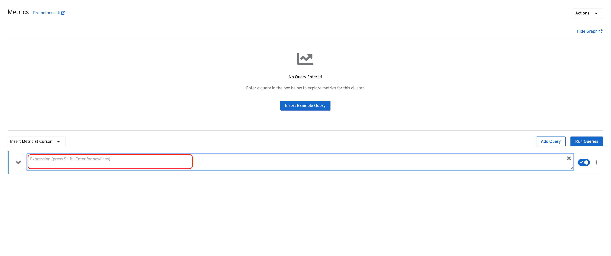

= OpenShift Data Foundationのデプロイと管理
// Activate experimental attribute for Keyboard Shortcut keys
:experimental:
:source-highlighter: pygments

== 演習概要

このモジュールは、OpenShift Data Foundation (ODF) のデプロイと管理方法に関心のある、システム管理者とアプリケーション開発者の両方を対象としています。 +
このモジュールでは、OpenShift Container Platform (OCP) 4.x と ODF Operatorを使用して、OCPワークロードの永続ストレージソリューションとして Ceph と Multi-Cloud-Gateway (MCG) をデプロイします。

=== 本演習で学習する内容

* コンテナ化されたCephとMCGの設定とデプロイ
* デプロイされたCephとMCGの検証
* CephおよびRADOSコマンドを実行するためのRook toolboxの導入
* Ceph RBDをベースとしたRead-Write-Once (RWO) PVCを使用したアプリケーションの作成
* CephFSをベースとしたRead-Write-Many (RWX) PVCを使用したアプリケーションの作成
* PrometheusおよびAlertManagerへのODFの適用
* MCGを使用したバケットの作成とアプリケーションからの使用
* Cephクラスタのストレージの拡張
* ODFのメトリクスとアラートの確認
* サポート情報を収集するためのmust-gatherの使用

.OpenShift Data Foundation コンポーネント
image::images/ocs/OCS-Pods-Diagram.png[OpenShift Data Foundation components]

NOTE: Cephの動作についてより詳しい情報が必要な場合は、このモジュールの演習を開始する前に<<Cephの概要>>のセクションを確認してください。

[[labexercises]]

== ODF Operatorを使用してストレージをデプロイする

=== OCPクラスタのスケールと新しいWorkerノードの追加

このセクションでは、ODFリソースのために3つのWorkerノードを追加してOCPクラスタをスケールする前に、まずOCP環境のWorkerノードを確認します。

[source,role="execute"]
----
oc get nodes -l node-role.kubernetes.io/worker -l '!node-role.kubernetes.io/infra','!node-role.kubernetes.io/master'
----
.出力例:
----
NAME                                         STATUS   ROLES    AGE   VERSION
ip-10-0-129-208.us-east-2.compute.internal   Ready    worker   15m   v1.22.8+c02bd9d
ip-10-0-157-116.us-east-2.compute.internal   Ready    worker   15m   v1.22.8+c02bd9d
ip-10-0-185-31.us-east-2.compute.internal    Ready    worker   15m   v1.22.8+c02bd9d
ip-10-0-215-4.us-east-2.compute.internal     Ready    worker   15m   v1.22.8+c02bd9d
----

ここで *MachineSets* を使用して、さらに3つのWorkerノードをクラスタに追加することになります。

[source,role="execute"]
----
oc get machinesets -n openshift-machine-api | grep -v infra
----

ここでは、既にクラスタに存在するWorkerノードを作成するために使用される、既存の *MachineSets* が表示されます。3つのAWS Availability Zone (AZ)それぞれに *MachineSet* が存在することが分かります。

.出力例:
----
NAME                                    DESIRED   CURRENT   READY   AVAILABLE   AGE
cluster-d6qlm-mbttv-worker-us-east-2a   2         2         2       2           27m
cluster-d6qlm-mbttv-worker-us-east-2b   1         1         1       1           27m
cluster-d6qlm-mbttv-worker-us-east-2c   1         1         1       1           27m
----

インフラストラクチャーノードの演習と同様に、新しい *MachineSets* を作成して、各AWS AZにOCP クラスターのストレージ専用ノードを作成します。

[source,role="execute"]
----
bash {{ HOME_PATH }}/support/machineset-generator.sh 3 workerocs 0 | oc create -f -
oc get machineset -n openshift-machine-api -l machine.openshift.io/cluster-api-machine-role=workerocs -o name | xargs oc patch -n openshift-machine-api --type='json' -p '[{"op": "add", "path": "/spec/template/spec/metadata/labels", "value":{"node-role.kubernetes.io/worker":"", "role":"storage-node", "cluster.ocs.openshift.io/openshift-storage":""} }]'
oc get machineset -n openshift-machine-api -l machine.openshift.io/cluster-api-machine-role=workerocs -o name | xargs oc scale -n openshift-machine-api --replicas=1
----

新しい *Machines* が作成されていることを確認します。

[source,role="execute"]
----
oc get machines -n openshift-machine-api | egrep 'NAME|workerocs'
----

しばらくは `Provisioning` または `Provisioned` の状態にありますが、最終的には `Running` の状態になります。

.出力例:
----
NAME                                             PHASE     TYPE         REGION      ZONE         AGE
cluster-d6qlm-mbttv-workerocs-us-east-2a-v8p5k   Running   m5.4xlarge   us-east-2   us-east-2a   4m39s
cluster-d6qlm-mbttv-workerocs-us-east-2b-dx69b   Running   m5.4xlarge   us-east-2   us-east-2b   4m38s
cluster-d6qlm-mbttv-workerocs-us-east-2c-g7hlh   Running   m5.4xlarge   us-east-2   us-east-2c   4m38s
----

workerocs *Machines* はAWS EC2の `m5.4xlarge` インスタンスタイプを使用していることがわかります。

NOTE: `m5.4xlarge` インスタンスタイプは、16vCPUと64GBのメモリを持ち、ODFで推奨されるスペックです。 +

さて、私たちの新しい *Machines* がOCPクラスタに追加されているかどうかを確認します。

[source,role="execute"]
----
watch "oc get machinesets -n openshift-machine-api | egrep 'NAME|workerocs'"
----

新しい workerocs *Machine Set* の全てで `READY` と `AVAILABLE` のカラムに数値(この場合は `1` )が表示されるまで待ちます。このステップには5分以上かかる場合があります。

.出力例:
----
NAME                                       DESIRED   CURRENT   READY   AVAILABLE   AGE
cluster-d6qlm-mbttv-workerocs-us-east-2a   1         1         1       1           5m25s
cluster-d6qlm-mbttv-workerocs-us-east-2b   1         1         1       1           5m25s
cluster-d6qlm-mbttv-workerocs-us-east-2c   1         1         1       1           5m25s
----
kbd:[Ctrl+C]を押すと終了できます。

最後に、3つのWorkerノードが追加されていることを確認します。全てのworker nodeの `STATUS` が `Ready` であることを確認します。

[source,role="execute"]
----
oc get nodes -l node-role.kubernetes.io/worker -l '!node-role.kubernetes.io/infra','!node-role.kubernetes.io/master'
----
.出力例:
----
NAME                                         STATUS   ROLES    AGE   VERSION
ip-10-0-129-208.us-east-2.compute.internal   Ready    worker   45m   v1.22.8+c02bd9d
ip-10-0-142-148.us-east-2.compute.internal   Ready    worker   13m   v1.22.8+c02bd9d
ip-10-0-157-116.us-east-2.compute.internal   Ready    worker   45m   v1.22.8+c02bd9d
ip-10-0-173-143.us-east-2.compute.internal   Ready    worker   13m   v1.22.8+c02bd9d
ip-10-0-185-31.us-east-2.compute.internal    Ready    worker   45m   v1.22.8+c02bd9d
ip-10-0-215-4.us-east-2.compute.internal     Ready    worker   45m   v1.22.8+c02bd9d
ip-10-0-219-73.us-east-2.compute.internal    Ready    worker   13m   v1.22.8+c02bd9d
----

新しいOCP WorkerノードがODF用のラベルを持っていることを確認します。 +
ODFを稼働させるノードには、`cluster.ocs.openshift.io/openshift-storage` という特定のラベルが付いている必要があります。 +
先に `workerocs` *MachineSets* を作成した時にこのラベルを追加しています。これらの *MachineSets* を使って作成されたすべての *Machine* はこのラベルを持つことになります。

[source,role="execute"]
----
oc get nodes -l cluster.ocs.openshift.io/openshift-storage=
----
.出力例:
----
NAME                                         STATUS   ROLES    AGE   VERSION
ip-10-0-142-148.us-east-2.compute.internal   Ready    worker   14m   v1.22.8+c02bd9d
ip-10-0-173-143.us-east-2.compute.internal   Ready    worker   14m   v1.22.8+c02bd9d
ip-10-0-219-73.us-east-2.compute.internal    Ready    worker   14m   v1.22.8+c02bd9d
----

=== ODF Operatorを使ったODFクラスタの作成

このセクションではOpenShift Data Foundation(ODF) Operatorをインストールし、新しく追加した3つのWorkerノードを使ってODFクラスターを作成します。 +
以下がインストールされます。
- ODF *OperatorGroup*
- ODF *Subscription*
- 他の全てのODF リソース (Operators, Ceph Pods, NooBaa Pods, StorageClasses)

はじめに `openshift-storage` Namespace を作成します。

[source,role="execute"]
----
oc create namespace openshift-storage
----

You must add the monitoring label to this namespace. This is required to get prometheus metrics and alerts for the OCP storage dashboards. To label the `openshift-storage` namespace use the following command:

このNamespaceには、モニタリング用のラベルを追加する必要があります。これは、OCPストレージダッシュボードの Prometheus メトリクスとアラートを取得するために必要です。 +
`openshift-storage` Namespaceにラベルを付けるには、次のコマンドを使用します。

[source,role="execute"]
----
oc label namespace openshift-storage "openshift.io/cluster-monitoring=true"
----

NOTE: `openshift-storage` Namespaceの作成とモニタリング用のラベル付けは、*OpenShift Web Console* を使用してODF Operatorのインストール時に行うこともできます。

*Openshift Web Console* を開きます。

{{ MASTER_URL }}

`kubeadmin` としてログインします。パスワードはこちらです。

[source,role="copypaste"]
----
{{ KUBEADMIN_PASSWORD }}
----

ログインしたら左側のメニューから、*Operators* -> *OperatorHub* を選択します。

.OCP OperatorHub
image::images/ocs/OCS-OCP-OperatorHub.png[OCP OperatorHub]

Now type `openshift data foundation` in the *Filter by _keyword..._* box.
*Filter by _keyword..._* のボックスに、`openshift data foundation` と入力します。

.OCP OperatorHub filter on OpenShift Data Foundation Operator
image::images/ocs/OCS4-OCP-OperatorHub-Filter.png[OCP OperatorHub Filter]

表示された `OpenShift Data Foundation Operator` を選択し、 *Install* ボタンを押します。

.OCP OperatorHub Install OpenShift Data Foundation
image::images/ocs/OCS4-OCP4-OperatorHub-Install.png[OCP OperatorHub Install]

次の画面で、設定が下図に示す通りであることを確認します。

.OCP Subscribe to OpenShift Data Foundation
image::images/ocs/OCS4-OCP4-OperatorHub-Subscribe.png[OCP OperatorHub Subscribe]

*Install* をクリックします。

ターミナルに戻って、下のコマンドを実行してインストール状況を確認できます。

[source,role="execute"]
----
watch oc -n openshift-storage get csv
----
.出力例:
----
NAME                  DISPLAY                       VERSION   REPLACES              PHASE
mcg-operator.v4.9.8   NooBaa Operator               4.9.8     mcg-operator.v4.9.7   Succeeded
ocs-operator.v4.9.8   OpenShift Container Storage   4.9.8     ocs-operator.v4.9.7   Succeeded
odf-operator.v4.9.8   OpenShift Data Foundation     4.9.8     odf-operator.v4.9.7   Succeeded
----
kbd:[Ctrl+C]を押すと終了できます。

リソース `csv` は `clusterserviceversions.operators.coreos.com` の短縮です。

.全てのOperatorの `PHASE` が `Succeeded` に変わるまで待って下さい。
CAUTION: 変わるまで数分かかる場合があります。

ODF Operatorのインストールが終わると、いくつかの新しいPodが `openshift-storage` Namespaceに作成されていることが確認できます。

[source,role="execute"]
----
oc -n openshift-storage get pods
----
.出力例:
----
NAME                                               READY   STATUS    RESTARTS   AGE
noobaa-operator-75847d5b48-krtpt                   1/1     Running   0          5m37s
ocs-metrics-exporter-7f855fc64c-xlc7s              1/1     Running   0          5m35s
ocs-operator-7cdd8cc9f5-khwlg                      1/1     Running   0          5m35s
odf-console-6bb644f8c4-vndfh                       1/1     Running   0          5m49s
odf-operator-controller-manager-5b767b7f4c-6jm2j   2/2     Running   0          5m49s
rook-ceph-operator-54d974474c-k82xz                1/1     Running   0          5m35s
----

*Openshift Web Console* に戻ってそれでは続いてストレージクラスターを作成します。 +

*Create StorageSystem* をクリックします。

.Create storage system in openshift-storage namespace
image::images/ocs/OCS4-OCP4-View-Operator.png[Create storage system in openshift-storage namespace]

`Create StorageSystem` の画面が表示されます。

.Configure storage system settings
image::images/ocs/OCS4-config-screen-partial1.png[Configure storage system settings]

*Backing storage* では `Use an existing StorageClass` を選択し、*Storage Class* には `gp2` を指定します。 +
*Deployment type* では `Full deployment` を指定します。

*Next* をクリックします 。

NOTE: 他のメニューの `Create a new StorageClass using local storage devices` は、Baremetal方式でインストールしたOCPクラスターでODFを構成する場合や、AWS EBSではないEC2 Instanceに元から存在するデバイスを使ってODFクラスターを構成する場合に使います。 +
また `Connect an external storage platform` は、外部ストレージとコントロールプレーンを統一する特殊なケースで使います。

.Select capacity and nodes for new storage system
image::images/ocs/OCS4-config-screen-partial2.png[Select capacity and nodes for new storage system]

*Select Capacity* では、`2 TiB` を指定します。

CAUTION: *ここで選択する Requested Capacity は、将来容量を拡張する際の最小単位として利用されます。* +
例えば初めに2 TiBを選択した場合は、以降は 2TiB 単位で拡張することになります。

*Select nodes* で、ODFクラスターで使うnodeを指定して *Next* をクリックします。
ODF用のラベル `cluster.ocs.openshift.io/openshift-storage` が付けられたノードは、ここで自動で選択されるようになっています。そのため、はじめから3つのWorkerノードが選択されているはずです。以下のコマンドを実行して、間違いがないことを確認してみましょう。

[source,role="execute"]
----
oc get nodes --show-labels | grep ocs | cut -d ' ' -f1
----

*Next* をクリックします 。

.ODF create a new storage cluster: Security and network
image::images/ocs/ODF4.9-config-screen-partial3.png[Select encryption and network]

*Encryption* では、何も選択しません。 +
クラスター全体、または部分的な暗号化を利用したい場合は、ここでチェックを入れます。今回の Lab では暗号化はしないので、チェックを外したままで構いません。 + 
（興味のある方は、チェックしてみてどのようなメニューが表示されるか確認されて構いません。*最後はチェックを外すよう注意してください*)

*Network* では、`Default (SDN)` を選択します。 +
Multus CNIを使ってPodで複数のネットワークを使用できる構成になっているOpenShiftクラスターでは、ODFでPublic NetworkとCluster Networkを分離することが可能です。 +
ここでは一般的な構成である、ネットワークを分離しないODFクラスターを構成するため、`Default (SDN)` を選択します。

*Next* をクリックします。

.Review and create new storage system
image::images/ocs/OCS4-config-screen-partial3.png[Review and create new storage system]

設定した内容をレビューし、問題がなければ *Create StorageSystem* をクリックします。

ターミナルウィンドウにすべての *Pods* が `Running` または `Completed` と表示されるまでお待ちください。これは5-10分かかります。

[source,role="execute"]
----
watch oc -n openshift-storage get pods
----
.出力例
----
NAME                                                              READY   STATUS      RESTARTS   AGE
csi-cephfsplugin-5gmvm                                            3/3     Running     0          7m29s
csi-cephfsplugin-8z6tf                                            3/3     Running     0          7m29s
csi-cephfsplugin-ksznb                                            3/3     Running     0          7m29s
csi-cephfsplugin-lxjl4                                            3/3     Running     0          7m29s
csi-cephfsplugin-provisioner-b99bc4cbd-5r6lr                      6/6     Running     0          7m28s
csi-cephfsplugin-provisioner-b99bc4cbd-92fqb                      6/6     Running     0          7m28s
csi-cephfsplugin-r9kn7                                            3/3     Running     0          7m29s
csi-cephfsplugin-vv44h                                            3/3     Running     0          7m29s
csi-rbdplugin-4528q                                               3/3     Running     0          7m30s
csi-rbdplugin-8qgx2                                               3/3     Running     0          7m30s
csi-rbdplugin-9qrl5                                               3/3     Running     0          7m30s
csi-rbdplugin-dv6kr                                               3/3     Running     0          7m30s
csi-rbdplugin-f2lnk                                               3/3     Running     0          7m30s
csi-rbdplugin-provisioner-58dbf8596d-89nkc                        6/6     Running     0          7m30s
csi-rbdplugin-provisioner-58dbf8596d-crzkr                        6/6     Running     0          7m30s
csi-rbdplugin-z2hkc                                               3/3     Running     0          7m30s
noobaa-core-0                                                     1/1     Running     0          2m39s
noobaa-db-pg-0                                                    1/1     Running     0          2m40s
noobaa-endpoint-864c59cc59-p5bz5                                  1/1     Running     0          85s
noobaa-operator-585b66865d-z7n6d                                  1/1     Running     0          73m
ocs-metrics-exporter-6f7fb77856-hzqxm                             1/1     Running     0          73m
ocs-operator-f5bb58ddf-7ngr8                                      1/1     Running     0          73m
odf-console-87bb59fb4-f9mc2                                       1/1     Running     0          73m
odf-operator-controller-manager-85f6cbddfb-bnqd6                  2/2     Running     0          73m
rook-ceph-crashcollector-639901b7a01a84b64f7e5c4a655e8490-jbd9w   1/1     Running     0          3m58s
rook-ceph-crashcollector-8537d53bc818115d1313e67321d95993-bkhlg   1/1     Running     0          4m6s
rook-ceph-crashcollector-abe3991bcdfa5e2f397ccd4ef3879a78-gz87c   1/1     Running     0          4m5s
rook-ceph-mds-ocs-storagecluster-cephfilesystem-a-cfb7488drfcjl   2/2     Running     0          3m2s
rook-ceph-mds-ocs-storagecluster-cephfilesystem-b-7678d586nlzj7   2/2     Running     0          3m1s
rook-ceph-mgr-a-9b9d56-mk5r7                                      2/2     Running     0          4m6s
rook-ceph-mon-a-74965cfc9f-btt7c                                  2/2     Running     0          7m12s
rook-ceph-mon-b-987b79745-bg9nt                                   2/2     Running     0          4m59s
rook-ceph-mon-c-555d55585-9bf88                                   2/2     Running     0          4m35s
rook-ceph-operator-55b4496c6b-kmlm6                               1/1     Running     0          73m
rook-ceph-osd-0-74cb6855bd-l46rl                                  2/2     Running     0          3m34s
rook-ceph-osd-1-6b4f4cccdf-w7g7w                                  2/2     Running     0          3m33s
rook-ceph-osd-2-64c888b48-gcs4n                                   2/2     Running     0          3m26s
rook-ceph-osd-prepare-ocs-deviceset-gp2-0-data-0wnh5j--1-xhgmf    0/1     Completed   0          4m
rook-ceph-osd-prepare-ocs-deviceset-gp2-1-data-08kht7--1-zw66k    0/1     Completed   0          4m
rook-ceph-osd-prepare-ocs-deviceset-gp2-2-data-0blmfh--1-dzdqk    0/1     Completed   0          3m59s
----
kbd:[Ctrl+C]を押すと終了できます。

OperatorとOpenShiftの素晴らしいところは、デプロイされたコンポーネントに関するインテリジェンスをOperatorが内蔵していることです。
また、Operatorは `CustomResource` を定義します。そのため `CustomResource` 自体を見ることでステータスを確認することができます。 +
ODFを例にすると、ODFクラスターをデプロイすると最終的には `StorageSystem` と `StorageCluster` のインスタンスが生成されていることが分かります。この `StorageSystem` と `StorageCluster` は ODF Operator によって定義された `CustomeResource` です。

`StorageCluster` のステータスは次のようにチェックできます。

[source,role="execute"]
----
oc get storagecluster -n openshift-storage
----

`Phase` のカラムが `Ready` となっていれば、続けることができます。

### ストレージダッシュボードの使用

このセクションでは、*OpenShift Web Console* に含まれている、ODF独自のダッシュボードを使ってストレージクラスターのステータスを確認します。 +
まず、ODF Operatorのインストール後に画面右上に次のようなポップアップが表示されている場合は、*Refersh web console* をクリックして画面を更新してください。

.ODF Dashboard after successful operator installation
image::images/ocs/ODF4.9-refresh-webconsole.png[ODF Dashboard after successful operator installation]

ダッシュボードは左側のメニューバーから *Storage* -> *OpenShift Data Foundation* とクリックすることでアクセスできます。

NOTE: ODFのデプロイが完了したばかりの場合、ダッシュボードが完全に表示されるまでに5〜10分かかります。

.Storage Dashboard after successful storage installation
image::images/ocs/OCS-dashboard-healthy.png[Storage Dashboard after successful storage installation]

Reference the for more information on how to use the *Dashboards*.

ダッシュボードの使用方法の詳細については、 https://access.redhat.com/documentation/en-us/red_hat_openshift_data_foundation/4.9/html/monitoring_openshift_data_foundation/cluster_health#verifying-openshift-data-foundation-is-healthy_rhodf[ODFモニタリングガイド]を参照してください。

全てが正常になると、ODFがインストール中に作成した3つの新しい *StorageClass* が使用可能になります。

- ocs-storagecluster-ceph-rbd
- ocs-storagecluster-cephfs
- openshift-storage.noobaa.io

*Storage* メニューの *Storage Classes* を選択することで、これら3つの *StorageClass* が表示されます。 +
また、以下のコマンドでも確認できます。

[source,role="execute"]
----
oc get storageclasses
----

上記の3つの *StorageClass* が使用可能であることを確認しましょう。

NOTE: MCGは `noobaa-core` Pod内部の `db` コンテナで利用するために `ocs-storagecluster-ceph-rbd` StorageClassを使用してPVCを作成しています。

=== Rook-Ceph toolboxを利用したCephクラスターの確認

このセクションでは、Rook-Ceph *toolbox* を利用して作成されたCephクラスターに対してcephコマンドを実行し、クラスター構成を確認します。
Rook-Ceph *toolbox* はODFに同梱されていないため、手動でデプロイする必要があります。

以下のコマンドで `OCSInitialization ocsinit` を修正します。

[source,role="execute"]
----
oc patch OCSInitialization ocsinit -n openshift-storage --type json --patch  '[{ "op": "replace", "path": "/spec/enableCephTools", "value": true }]'
----

`rook-ceph-tools` Pod が `Running` になれば、次のようにtoolbox Podに入ることができます。

[source,role="execute"]
----
TOOLS_POD=$(oc get pods -n openshift-storage -l app=rook-ceph-tools -o name)
oc rsh -n openshift-storage $TOOLS_POD
----
*toolbox* Podに入ったら、次のcephコマンドを実行してみて下さい。これらのコマンドによってCephクラスターの詳細な構成を確認することができます。

[source,role="execute"]
----
ceph status
----

[source,role="execute"]
----
ceph osd status
----

[source,role="execute"]
----
ceph osd tree
----

[source,role="execute"]
----
ceph df
----

[source,role="execute"]
----
rados df
----

[source,role="execute"]
----
ceph versions
----

.出力例:
----
sh-4.4$ ceph status
  cluster:
    id:     cbeb7c9d-2a30-4646-b5a6-72d5c1db914c
    health: HEALTH_OK

  services:
    mon: 3 daemons, quorum a,b,c (age 19m)
    mgr: a(active, since 19m)
    mds: 1/1 daemons up, 1 hot standby
    osd: 3 osds: 3 up (since 18m), 3 in (since 19m)

  data:
    volumes: 1/1 healthy
    pools:   4 pools, 97 pgs
    objects: 92 objects, 133 MiB
    usage:   249 MiB used, 6.0 TiB / 6 TiB avail
    pgs:     97 active+clean

  io:
    client:   1.2 KiB/s rd, 5.0 KiB/s wr, 2 op/s rd, 0 op/s wr
----
kbd:[Ctrl+D] を押すか、 `exit` を実行して *toolbox* から出ることができます.

[source,role="execute"]
----
exit
----

== Ceph RBD volumeを使用するOCPアプリケーションを作成する

このセクションでは、`ocs-storagecluster-ceph-rbd` *StorageClass* を使ってRWO(ReadWriteOnce) Presistent Volume Claimを作成し、RailsアプリケーションとPostgreSQLデータベースをデプロイします。永続ストレージは、Cephプール `ocs-storagecluster-cephblockpool` にあるCeph RBD (RADOS Block Device) ボリュームです。

ここで利用する OpenShift rails-pgsql-persistentテンプレートをベースに作成したテンプレートファイルを次のリンク先に作成しています。 +
`https://raw.githubusercontent.com/tutsunom/ocs-training/jp/ocp4ocs4/configurable-rails-app.yaml` +
このファイルには、PVCが使用するStorageClassをエンドユーザーが指定できる追加のパラメーター `STORAGE_CLASS` が含まれています。ダウンロードして確認してみて下さい。

NOTE: Rails + PostgreSQLのデプロイを開始できるように、前のセクションをすべて完了したことを確認してください。

はじめに新規のプロジェクトを作成します。

[source,role="execute"]
----
oc new-project my-database-app
----

そして、`rails-pgsql-persistent` テンプレートを使用して新しいアプリケーションを作成します。

[source,role="execute"]
----
oc new-app -f {{ HOME_PATH }}/support/ocslab_rails-app.yaml -p STORAGE_CLASS=ocs-storagecluster-ceph-rbd -p VOLUME_CAPACITY=5Gi
----

デプロイが始まったら `oc status` コマンドでデプロイの様子を監視できます。

[source,role="execute"]
----
oc status
----

次に、PVCを確認します。先程のテンプレートファイルの中にPVCのマニフェストが記載されているので、PVCが発行されています。PVCが作られていることを確認しましょう。

[source,role="execute"]
----
oc get pvc -n my-database-app
----

以下に示すように、2つのpodが `Running` STATUSで、4つのpodが `Completed` STATUSになるまで待ちます。
このステップには5分以上かかる場合があります。

[source,role="execute"]
----
watch oc get pods -n my-database-app
----
.出力例:
----
NAME                                READY   STATUS      RESTARTS   AGE
postgresql-1-deploy                 0/1     Completed   0          5m48s
postgresql-1-lf7qt                  1/1     Running     0          5m40s
rails-pgsql-persistent-1-build      0/1     Completed   0          5m49s
rails-pgsql-persistent-1-deploy     0/1     Completed   0          3m36s
rails-pgsql-persistent-1-hook-pre   0/1     Completed   0          3m28s
rails-pgsql-persistent-1-pjh6q      1/1     Running     0          3m14s
----
kbd:[Ctrl+C] を押すと終了できます。

アプリケーションがPersistent VolumeとしてCeph RBDボリュームを使用しているかどうかテストできます。

[source,role="execute"]
----
oc get route rails-pgsql-persistent -n my-database-app -o jsonpath --template="http://{.spec.host}/articles{'\n'}"
----

.出力例:
----
http://rails-pgsql-persistent-my-database-app.apps.cluster-ocs4-8613.ocs4-8613.sandbox944.opentlc.com/articles
----

出力されたURLをブラウザウィンドウにコピーしてアクセスします。

Webページの *New Article* をクリックし、次の `username` と `password` を入力することで記事やコメントを作成することができます。 +

----
username: openshift
password: secret
----

何でもよいので、ここで1つ記事を作成してください。

作成された記事とコメントはPostgreSQLデータベースに保存されます。PostgreSQLデータベースは、アプリケーションのデプロイ中に `ocs-storagecluster-ceph-rbd` *StorageClass* を使ってプロビジョニングされたCeph RBDボリュームにテーブルスペースを保存します。 +
そのため、PostgreSQLのPodを削除してもデータが失われることはありません。試しにPostgreSQLのPodを削除してみましょう。 +
PostgreSQLのPodは *DeploymentConfig* によって削除されても自動的に再作成され、すでに存在するPVを自動でマウントするようになっています。

PostgreSQLのPodが再作成されたら、再びRailsのWebアプリケーションにアクセスしてみて下さい。キャッシュを消しても先に書いた記事が残っていることが確認できます。

[source,role="execute"]
----
oc delete $(oc get pod -l name=postgresql -n my-database-app -o name) -n my-database-app
----
.ターミナルのプロンプトが戻ってくるまで待って下さい。
CAUTION: プロンプトが戻ってくるまで数分かかる場合があります。

先程作成したPVは、`ocs-storagecluster-cephblockpool` プール内に作られるCeph RBD(RADOS Block Device)ボリュームです。ここではPVとCeph RBDボリュームとがどのように対応しているか確認してみます。 +
ここでtoolboxにログインして、`ocs-storagecluster-cephblockpool` をもう一度見てみましょう。

[source,role="execute"]
----
TOOLS_POD=$(oc get pods -n openshift-storage -l app=rook-ceph-tools -o name)
oc rsh -n openshift-storage $TOOLS_POD
----

下記のようにアプリケーションのデプロイ前と同じCephコマンドを実行し、前のセクションの結果と比較します。
`ocs-storagecluster-cephblockpool` のオブジェクト数が増えていることに注意して下さい。 +
また、3つ目のコマンドはCeph RBDボリュームをリストする処理をしますが、2つ表示されるはずです。

[source,role="execute"]
----
ceph df
----
[source,role="execute"]
----
rados df
----
[source,role="execute"]
----
rbd -p ocs-storagecluster-cephblockpool ls | grep vol
----
kbd:[Ctrl+D] を押すか、 `exit` を実行してtoolboxから出ることができます。

[source,role="execute"]
----
exit
----

=== PVとRBDの照会

どのPVがどのCeph RBDボリュームに対応するかの照会を行ってみましょう。 +
次のコマンドを実行してPVの `Volume Handle` を確認します。

[source,role="execute"]
----
oc get pv -o 'custom-columns=NAME:.spec.claimRef.name,PVNAME:.metadata.name,STORAGECLASS:.spec.storageClassName,VOLUMEHANDLE:.spec.csi.volumeHandle'
----
.出力例:
----
NAME                              PVNAME                                     STORAGECLASS                  VOLUMEHANDLE
ocs-deviceset-gp2-0-data-0pdj4t   pvc-0c76938c-466b-4419-9c65-2d697d0c6475   gp2                           <none>
rook-ceph-mon-b                   pvc-4583b95b-41c9-4e3c-8729-426ce36481e9   gp2                           <none>
db-noobaa-db-pg-0                 pvc-53d01ae5-7b35-40c0-904a-5aa4b24c2241   ocs-storagecluster-ceph-rbd   0001-0011-openshift-
storage-0000000000000001-a5b03a0e-e22c-11ec-855c-0a580a82020c
ocs-deviceset-gp2-1-data-0m5bzn   pvc-5a41d153-6067-4ba1-bd5f-805a53599f84   gp2                           <none>
rook-ceph-mon-a                   pvc-5b74a2a5-8169-4e8f-b7c9-d832062139cb   gp2                           <none>
rook-ceph-mon-c                   pvc-712abc46-28ae-4f7a-b54b-79f92c768b79   gp2                           <none>
postgresql                        pvc-a726b00b-c97f-478c-a841-20276c2a4563   ocs-storagecluster-ceph-rbd   0001-0011-openshift-
storage-0000000000000001-e61c53cd-e230-11ec-855c-0a580a82020c
ocs-deviceset-gp2-2-data-04xwqf   pvc-ded9b4c7-8bd6-4e03-beab-ee416d4407fa   gp2                           <none>
----

`VOLUMEHANDLE` カラムの後半部分は、Ceph RBDの名前と一致していることがわかります。この前に `csi-vol-` をつけることで完全なRBDを取得することができます。 +

[source,role="execute"]
----
CSIVOL=$(oc get pv $(oc get pv | grep my-database-app | awk '{ print $1 }') -o jsonpath='{.spec.csi.volumeHandle}' | cut -d '-' -f 6- | awk '{print "csi-vol-"$1}')
echo $CSIVOL
----

.出力例:
----
csi-vol-e61c53cd-e230-11ec-855c-0a580a82020c
----

再度toolboxを使ってCeph RBDボリュームの詳細を確認すると、上で出力されたものと同じ名前のRBDボリュームが表示されるはずです。

[source,role="execute"]
----
TOOLS_POD=$(oc get pods -n openshift-storage -l app=rook-ceph-tools -o name)
oc rsh -n openshift-storage $TOOLS_POD rbd -p ocs-storagecluster-cephblockpool info $CSIVOL
----

.出力例:
----
rbd image 'csi-vol-e61c53cd-e230-11ec-855c-0a580a82020c':
        size 5 GiB in 1280 objects
        order 22 (4 MiB objects)
        snapshot_count: 0
        id: 38f2ba527cd8
        block_name_prefix: rbd_data.38f2ba527cd8
        format: 2
        features: layering
        op_features:
        flags:
        create_timestamp: Thu Jun  2 05:00:18 2022
        access_timestamp: Thu Jun  2 05:00:18 2022
        modify_timestamp: Thu Jun  2 05:00:18 2022
----

=== Ceph RBD PVCの拡張

OpenShift 4.5以降のバージョンでは、`ocs-storagecluster-ceph-rbd` *StorageClass* をベースに既存のPVCを拡張することができます。このセクションでは、PVC拡張を実行するための手順を説明します。

まず、作成したばかりのアプリケーションで使用しているPVCを人為的に満杯にします。

[source,role="execute"]
----
oc rsh -n my-database-app $(oc get pods -n my-database-app|grep postgresql | grep -v deploy | awk {'print $1}')
----
[source,role="execute"]
----
df
----
.出力例:
----
Filesystem     1K-blocks     Used Available Use% Mounted on
overlay        125293548 18512264 106781284  15% /
tmpfs              65536        0     65536   0% /dev
tmpfs           32566396        0  32566396   0% /sys/fs/cgroup
shm                65536       16     65520   1% /dev/shm
tmpfs           32566396    54320  32512076   1% /etc/passwd
/dev/nvme0n1p4 125293548 18512264 106781284  15% /etc/hosts
/dev/rbd0        5095040    69280   5009376   2% /var/lib/pgsql/data
tmpfs             524288       24    524264   1% /run/secrets/kubernetes.io/serviceaccount
tmpfs           32566396        0  32566396   0% /proc/acpi
tmpfs           32566396        0  32566396   0% /proc/scsi
tmpfs           32566396        0  32566396   0% /sys/firmware
----

上の出力にあるように、`/dev/rbd1` という名前のデバイスは `/var/lib/pgsql/data` という名前でマウントされています。このディレクトリを人為的に満杯にします。

[source,role="execute"]
----
dd if=/dev/zero of=/var/lib/pgsql/data/fill.up bs=1M count=3850
----
.出力例:
----
3850+0 records in
3850+0 records out
4037017600 bytes (4.0 GB) copied, 13.6446 s, 296 MB/s
----

マウントされたボリュームの使用容量を確認します。

[source,role="execute"]
----
df
----
.出力例:
----
Filesystem     1K-blocks     Used Available Use% Mounted on
overlay        125293548 18512272 106781276  15% /
tmpfs              65536        0     65536   0% /dev
tmpfs           32566396        0  32566396   0% /sys/fs/cgroup
shm                65536       16     65520   1% /dev/shm
tmpfs           32566396    54320  32512076   1% /etc/passwd
/dev/nvme0n1p4 125293548 18512272 106781276  15% /etc/hosts
/dev/rbd0        5095040  4011684   1066972  79% /var/lib/pgsql/data
tmpfs             524288       24    524264   1% /run/secrets/kubernetes.io/serviceaccount
tmpfs           32566396        0  32566396   0% /proc/acpi
tmpfs           32566396        0  32566396   0% /proc/scsi
tmpfs           32566396        0  32566396   0% /sys/firmware
----

上記の出力で観察されるように、`/var/lib/pgsql/data` のファイルシステム使用量は79%まで増加しています。デフォルトでは、OCPはPVCが75%の使用量を超えたときにPVCアラートを生成します。

Podから出ます。

[source,role="execute"]
----
exit
----

OCPのイベントログにアラートが表示されていることを確認しましょう。

.OpenShift Container Platform Events
image::images/ocs/OCS-PVCResize-pvcnearfull-alert.png[PVC nearfull alert]

==== PVCのYAMLファイルを変更することによる拡張

PVCを拡張するには、*PVC* で要求しているストレージ容量を変更する必要があります。これは、次のコマンドで *PVC* のマニフェストをYAMLファイルにエクスポートすることで簡単に実行できます。

[source,role="execute"]
----
oc get pvc postgresql -n my-database-app -o yaml > pvc.yaml
----

作成されたファイル `pvc.yaml` の中で、`spec:` セクションを確認します。

[source,role="execute"]
----
cat pvc.yaml
----
.出力例:
[source,yaml]
----
[省略]
spec:
  accessModes:
  - ReadWriteOnce
  resources:
    requests:
      storage: 5Gi
  storageClassName: ocs-storagecluster-ceph-rbd
  volumeMode: Filesystem
  volumeName: pvc-a726b00b-c97f-478c-a841-20276c2a4563
[省略]
----

この `storage: 5Gi` の部分を `storage: 10Gi` に置き換えます。その結果、ファイル内のセクションは以下のような出力になるはずです。

[source,role="execute"]
----
sed -ie 's/storage: 5Gi/storage: 10Gi/' pvc.yaml
cat pvc.yaml
----
.出力例:
[source,yaml]
----
[省略]
spec:
  accessModes:
  - ReadWriteOnce
  resources:
    requests:
      storage: 10Gi
  storageClassName: ocs-storagecluster-ceph-rbd
  volumeMode: Filesystem
  volumeName: pvc-4d6838df-b4cd-4bb1-9969-1af93c1dc5e6
[省略]
----

次のコマンドで、更新した *PVC* のマニフェストを適用することができます。
[source,role="execute"]
----
oc apply -f pvc.yaml -n my-database-app
----
.出力例:
----
Warning: resource persistentvolumeclaims/postgresql is missing the kubectl.kubernetes.io/last-applied-configuration annotation
which is required by oc apply. oc apply should only be used on resources created declaratively by either oc create --save-confi
g or oc apply. The missing annotation will be patched automatically.
persistentvolumeclaim/postgresql configured
----

以下のコマンドで *PVC* の拡張の進捗状況を見ることができます。

[source,role="execute"]
----
oc describe pvc postgresql -n my-database-app
----
.出力例:
----
[省略]
Finalizers:    [kubernetes.io/pvc-protection]
Capacity:      10Gi
Access Modes:  RWO
VolumeMode:    Filesystem
Used By:       postgresql-1-5vtp4
Events:
  Type     Reason                      Age   From
                                 Message
  ----     ------                      ----  ----
                                 -------
  Normal   Provisioning                45m   openshift-storage.rbd.csi.ceph.com_csi-rbdplugin-provisioner-789f79dcf-jwnzp_9972e
629-2de3-411a-85da-39ffa1f8cfc6  External provisioner is provisioning volume for claim "my-database-app/postgresql"
  Normal   ExternalProvisioning        45m   persistentvolume-controller
                                 waiting for a volume to be created, either by external provisioner "openshift-storage.rbd.csi.
ceph.com" or manually created by system administrator
  Normal   ProvisioningSucceeded       45m   openshift-storage.rbd.csi.ceph.com_csi-rbdplugin-provisioner-789f79dcf-jwnzp_9972e
629-2de3-411a-85da-39ffa1f8cfc6  Successfully provisioned volume pvc-a726b00b-c97f-478c-a841-20276c2a4563
  Normal   Resizing                    55s   external-resizer openshift-storage.rbd.csi.ceph.com
                                 External resizer is resizing volume pvc-a726b00b-c97f-478c-a841-20276c2a4563
  Warning  ExternalExpanding           55s   volume_expand
                                 Ignoring the PVC: didn't find a plugin capable of expanding the volume; waiting for an externa
l controller to process this PVC.
  Normal   FileSystemResizeRequired    55s   external-resizer openshift-storage.rbd.csi.ceph.com
                                 Require file system resize of volume on node
  Normal   FileSystemResizeSuccessful  27s   kubelet
                                 MountVolume.NodeExpandVolume succeeded for volume "pvc-a726b00b-c97f-478c-a841-20276c2a4563"
----

NOTE: 拡張処理は一般的に30秒以上かかり、Podの負荷に依存します。これは、拡張にはベースとなるRBDイメージのサイズ変更(かなり高速)と、ブロックデバイスの上に位置するファイルシステムのサイズ変更が必要なためです。後者を実行するには、ファイルシステムを安全に拡張できるように静止させる必要があります。

CAUTION: *PVC* の縮小はサポートされません。

また、*PVC* の拡張を確認する方法として、シンプルに以下のコマンドで *PVC* の情報を表示させる方法もあります。

[source,role="execute"]
----
oc get pvc -n my-database-app
----
.出力例:
----
NAME         STATUS   VOLUME                                     CAPACITY   ACCESS MODES   STORAGECLASS                  AGE
postgresql   Bound    pvc-a726b00b-c97f-478c-a841-20276c2a4563   10Gi       RWO            ocs-storagecluster-ceph-rbd   49m
----

NOTE: `CAPACITY` カラムには、拡張処理が完了した時点で新しく要求されたサイズが表示されます。

*PVC* の拡張を確認するもう1つの方法は、CLIを介して *PVC* オブジェクトの2つのフィールドを調べることです。

*PVC* が現在の割り当てられているサイズを確認するには、次のコマンドを実行します。
[source,role="execute"]
----
echo $(oc get pvc postgresql -n my-database-app -o jsonpath='{.status.capacity.storage}')
----
.出力例:
----
10Gi
----

*PVC* で要求されたサイズを確認するには、次のコマンドを実行します。
[source,role="execute"]
----
echo $(oc get pvc postgresql -n my-database-app -o jsonpath='{.spec.resources.requests.storage}')
----
.出力例:
----
10Gi
----

NOTE: 両方の結果が同じ値を報告する場合、拡張は成功したことになります。

==== GUIを使った拡張
*PVC* 拡張の最後の方法は、*OpenShift Web Console* を使って行うことです。以下のように進めます。

最初のステップは、*PVC* が属するプロジェクトを選択することです。

.Select the appropriate project
image::images/ocs/OCS-PVCResize-select-project.png[Select project]

*PVC* のコンテキストメニュー(縦に3つの点が並んだアイコン)から、`Expand PVC` を選択します。

.Choose Expand from menu
image::images/ocs/OCS-PVCResize-choose-expand-menu.png[Choose expand from the contextual menu]

表示されるダイアログボックスで、*PVC* の新しい容量を入力します。

CAUTION: *PVC* のサイズを小さくすることはできません。

.Enter the new size for the *PVC*
image::images/ocs/OCS-PVCResize-enter-new-size.png[Enter new size]

あとは拡張が完了し、新しいサイズ(15GiB)が反映されるのを待つだけです。

.Wait for the expansion to complete
image::images/ocs/OCS-PVCResize-verify-resize-worked2.png[Wait for expansion]

== CephFS volumeを使用するOCPアプリケーションを作成する

このセクションでは、`ocs-storagecluster-cephfs` *StorageClass* を使用して、同時に複数のポッドで使用できるRWX(ReadWriteMany) *PVC* を作成します。ここでは `File Uploader` と呼ばれるアプリケーションを使用します。

はじめに新しいProjectを作成します

[source,role="execute"]
----
oc new-project my-shared-storage
----

次に `file-uploader` というサンプルPHPアプリケーションをデプロイします。

[source,role="execute"]
----
oc new-app openshift/php~https://github.com/christianh814/openshift-php-upload-demo --name=file-uploader
----

.出力例:
----
--> Found image f2b8dfb (4 weeks old) in image stream "openshift/php" under tag "7.4-ubi8" for "openshift/php"

    Apache 2.4 with PHP 7.4
    -----------------------
    PHP 7.4 available as container is a base platform for building and running various PHP 7.4 applications and frameworks. PHP
 is an HTML-embedded scripting language. PHP attempts to make it easy for developers to write dynamically generated web pages.
PHP also offers built-in database integration for several commercial and non-commercial database management systems, so writing
 a database-enabled webpage with PHP is fairly simple. The most common use of PHP coding is probably as a replacement for CGI s
cripts.

    Tags: builder, php, php74, php-74

    * A source build using source code from https://github.com/christianh814/openshift-php-upload-demo will be created
      * The resulting image will be pushed to image stream tag "file-uploader:latest"
      * Use 'oc start-build' to trigger a new build

--> Creating resources ...
    imagestream.image.openshift.io "file-uploader" created
    buildconfig.build.openshift.io "file-uploader" created
    deployment.apps "file-uploader" created
    service "file-uploader" created
--> Success
    Build scheduled, use 'oc logs -f buildconfig/file-uploader' to track its progress.
    Application is not exposed. You can expose services to the outside world by executing one or more of the commands below:
     'oc expose service/file-uploader'
    Run 'oc status' to view your app.
----

ビルドログを見ながら、アプリケーションのデプロイが終わるのを待ちます。

[source,role="execute"]
----
oc logs -f bc/file-uploader -n my-shared-storage
----

.出力例:
----
Cloning "https://github.com/christianh814/openshift-php-upload-demo" ...
        Commit: 288eda3dff43b02f7f7b6b6b6f93396ffdf34cb2 (trying to modularize)
        Author: Christian Hernandez <christian.hernandez@yahoo.com>
        Date:   Sun Oct 1 17:15:09 2017 -0700
[...]
---> Installing application source...
=> sourcing 20-copy-config.sh ...
---> 06:13:01     Processing additional arbitrary httpd configuration provided by s2i ...
=> sourcing 00-documentroot.conf ...
=> sourcing 50-mpm-tuning.conf ...
=> sourcing 40-ssl-certs.sh ...
STEP 9/9: CMD /usr/libexec/s2i/run
COMMIT temp.builder.openshift.io/my-shared-storage/file-uploader-1:15d825ae
time="2022-06-02T06:13:01Z" level=warning msg="Adding metacopy option, configured globally"
Getting image source signatures
[...]
Writing manifest to image destination
Storing signatures
--> fc6b7ec51dc
Successfully tagged temp.builder.openshift.io/my-shared-storage/file-uploader-1:15d825ae
fc6b7ec51dc704e22e6e81e6953144af54044b360964f727ca214952a7ee9e0c

Pushing image image-registry.openshift-image-registry.svc:5000/my-shared-storage/file-uploader:latest ...
Getting image source signatures
[...]
Writing manifest to image destination
Storing signatures
Successfully pushed image-registry.openshift-image-registry.svc:5000/my-shared-storage/file-uploader@sha256:934865d3d0ecef92024
eaef2b416f47fa7a7598f820c48624cc57d39cce221c5
Push successful
----

The command prompt returns out of the tail mode once you see _Push successful_.
_Push successful_ が表示されるとデプロイ完了です。デプロイ完了までに5分ほどかかる場合があります。

NOTE: ここでは `oc new-app` コマンドを使って直接アプリケーションコードのビルドを要求しているので、テンプレートがありません。このアプリケーションが *Service* を持つ単一のPodで、*Route* を持たないのはこのためです。

このアプリケーションを `Route` 経由で公開し、高可用性のために3つのインスタンスに拡張することで、本番利用に対応できるようにしましょう。

[source,role="execute"]
----
oc expose svc/file-uploader -n my-shared-storage
----
[source,role="execute"]
----
oc scale --replicas=3 deploy/file-uploader -n my-shared-storage
----
[source,role="execute"]
----
oc get pods -n my-shared-storage
----

数分で3つの `file-uploader` Podが作られます。

[CAUTION]
====
PVが関連付けられていないPodには永続的なデータを保存しようとしないでください。
Podとそのコンテナは定義上エフェメラルなものであり、保存されたデータはPodが何らかの理由で終了するとすぐに失われます。
====

ReadWriteMany(RWX) の *PVC* を作成し、`oc set volume` コマンドを使用してアプリケーションにアタッチできます。
次のように実行します。

[source,role="execute"]
----
oc set volume deploy/file-uploader --add --name=my-shared-storage \
-t pvc --claim-mode=ReadWriteMany --claim-size=1Gi \
--claim-name=my-shared-storage --claim-class=ocs-storagecluster-cephfs \
--mount-path=/opt/app-root/src/uploaded \
-n my-shared-storage
----

このコマンドによって次のことが行われます。

* *PVC* を作成する
* `volume` の定義が含まれるように *Deployment* を更新する
* 指定された `mount-path` にボリュームをマウントするよう *Deployment* を更新する
* 3つのアプリケーションのPodを改めてデプロイする

さて、ボリュームを追加した結果を見てみましょう。

[source,role="execute"]
----
oc get pvc -n my-shared-storage
----

.出力例:
----
NAME                STATUS   VOLUME                                     CAPACITY   ACCESS MODES   STORAGECLASS                AGE
my-shared-storage   Bound    pvc-43a7067c-e39e-48c7-94cd-3bb16ea98488   1Gi        RWX            ocs-storagecluster-cephfs   2m33s
----

`ACCESSMODE` が *RWX*(`ReadWriteMany`)に設定されています。 +

3つの `file-uploader` Podはすべて、同じ *RWX PVC* を使用しています。
*RWX* の `ACCESSMODE` を使用することで、複数のノードにアプリケーションPodをスケジュールすることができます。 +
*RWX* の `ACCESSMODE` でないと、OpenShiftは複数のPodに同じ *PV* を接続しようとしません。仮に *RWO*(`ReadWriteOnce`) の *PVC* で *PV* をアタッチしたPodをスケールしようとすると、Podは全て同一のノード上に配置されることになります。

次のコマンドでこのPVが3つの `file-uploader` Pod全てから同時にマウントされていることが確認できます。

[source,role="execute"]
----
oc get pod -n my-shared-storage --field-selector=status.phase=Running -o 'custom-columns=NAME:.metadata.name,PVCNAME:.spec.containers[].volumeMounts[].name,MOUNTPOINT:.spec.containers[].volumeMounts[].mountPath'
----
.出力例
----
NAME                             PVCNAME             MOUNTPOINT
file-uploader-665884f976-blm9p   my-shared-storage   /opt/app-root/src/uploaded
file-uploader-665884f976-htsvf   my-shared-storage   /opt/app-root/src/uploaded
file-uploader-665884f976-hxmhh   my-shared-storage   /opt/app-root/src/uploaded
----

それでは、ブラウザを使って `file-uploader` のWebアプリケーションを使い、新しいファイルをアップロードしてみましょう。 +
作成された *Route* を確認します。

[source,role="execute"]
----
oc get route file-uploader -n my-shared-storage -o jsonpath --template="http://{.spec.host}{'\n'}"
----
.出力例:
----
http://file-uploader-my-shared-storage.apps.cluster-d6qlm.d6qlm.sandbox458.opentlc.com
----

出力されたURLを使用してブラウザでWebアプリケーションを指定します。

このWebアプリケーションは、アップロードされたすべてのファイルをリストし、新しいファイルをアップロードする機能と、
既存のデータをダウンロードする機能を提供します。現時点では何もありません。

ローカルマシンから任意のファイルを選択し、アプリケーションにアップロードします。

.A simple PHP-based file upload tool
image::images/ocs/uploader_screen_upload.png[]

完了したら、*List uploaded files* をクリックして、現在アップロードされているすべてのファイルのリストを表示します。

==== 演習
また、先のコマンドで確認した3つの `file-uploader` Podの `MOUNTPOINT` に同じファイルが保存されていることを確認してみましょう。 +
`oc rsh` コマンドを使って、それぞれの `file-uploader` Pod に対して `MOUNTPOINT` のパスに対して `ls` コマンドを実行することで確認できます。

ヒント:

----
oc -n my-shared-storage rsh <Pod name> ls <MOUNTPOINT>
----

=== CephFS PVの拡張

OpenShift 4.5以降のバージョンでは、`ocs-storagecluster-cephfs` *StorageClass* をベースに既存のPVCを拡張することができます。このセクションでは、CLIを使ってPVC拡張を実行する手順を説明します。

NOTE: Ceph RBDベースの *PVC* を拡張するために説明された、他のすべての方法も利用可能です。

`my-sharged-storage` の *PVC* サイズは現在 `1Gi` です。これを `oc patch` コマンドで `5Gi` まで大きくしてみましょう。

[source,role="execute"]
----
oc patch pvc my-shared-storage -n my-shared-storage --type json --patch  '[{ "op": "replace", "path": "/spec/resources/requests/storage", "value": "5Gi" }]'
----
.出力例:
----
persistentvolumeclaim/my-shared-storage patched
----

それでは、RWXの *PVC* が拡張されたことを確認します。

[source,role="execute"]
----
echo $(oc get pvc my-shared-storage -n my-shared-storage -o jsonpath='{.spec.resources.requests.storage}')
----
.出力例:
----
5Gi
----

[source,role="execute"]
----
echo $(oc get pvc my-shared-storage -n my-shared-storage -o jsonpath='{.status.capacity.storage}')
----
.出力例:
----
5Gi
----

出力が同じになるまで、両方のコマンドを繰り返します。

NOTE: CephFSベースのRWX *PVC* の拡張は、RBDベースの *PVC* とは異なり、ほぼ瞬時に行われます。これは、CephFSベースの *PVC* の拡張にはファイルシステムの拡張が含まれず、単にマウントされたファイルシステムのクォータを変更するだけだからです。

CAUTION: CAUTION: CephFS *PVC* の縮小はサポートされません。

== PVCのクローンとスナップショット

OpenShift Container Storage(OCS) 4.6から、*PV* のクローンやスナップショットを可能にする `Container Storage Interface` (CSI) の機能がサポートされるようになりました。これらの新しい機能は永続的なデータ保護のために非常に重要であり、CSIと連携できるサードパーティベンダーの `Backup and Restore` ソフトウェアと一緒に使用することができます。

Ceph RBDとCephFSの *PVC* のスナップショットは、サードパーティベンダーの `Backup and Restore` ソフトウェアに加えて、`OpenShift APIs for Data Protection (OADP)` を使用してトリガーすることもできます。`OADP` はレッドハットがサポートしている `Operator` で、*OperatorHub* からインストールできます。永続データや OpenShiftのメタデータ(Pods, Services, Routes, Deployments の定義ファイルなど)のバックアップとリストアのテストに非常に有効なものです。

=== PVCのクローン

CSIボリュームクローンは特定の時点における既存の *PV* の複製で、ODFでは指定されたボリュームの複製を作成します。ダイナミックプロビジョニングで作成した *PVC* のクローンを使用することができます。

==== CSIボリュームクローン

この演習では、15GiBに拡張されたばかりの作成済みの *PVC* `postgresql` を使用します。先に進む前に、セクション <<Ceph RBD volumeを使用するOCPアプリケーションを作成する>> を完了していることを確認してください。

[source,role="execute"]
----
oc get pvc -n my-database-app | awk '{print $1}'
----
.出力例:
----
NAME
postgresql
----

CAUTION: 先に進む前に、`postgresql` *PVC* を15Giに拡張していることを確認してください。拡張していない場合は、戻って <<Ceph RBD PVCの拡張>> セクションを完了させてください。 

PVCクローンを作成する前に、少なくとも1つの新しい記事を作成し保存して、`postgresql` *PVC* に新しいデータがあることを確認してください。

[source,role="execute"]
----
oc get route rails-pgsql-persistent -n my-database-app -o jsonpath --template="http://{.spec.host}/articles{'\n'}"  
----

.出力例:
----
http://rails-pgsql-persistent-my-database-app.apps.cluster-ocs4-8613.ocs4-8613.sandbox944.opentlc.com/articles
----

Webページの *New Article* をクリックし、次の `username` と `password` を入力することで記事やコメントを作成することができます。 +

----
username: openshift
password: secret
----

この *PVC* 内のデータ(記事)を保護するために、この *PVC* のクローンを作ります。クローンの作成は、*OpenShift Web Console* を使用するか、以下のようなYAMLファイルでリソースを作成することで行うことができます。

[source,yaml]
----
apiVersion: v1
kind: PersistentVolumeClaim
metadata:
  name: postgresql-clone
  namespace: my-database-app
spec:
  storageClassName: ocs-storagecluster-ceph-rbd
  accessModes:
    - ReadWriteOnce
  resources:
    requests:
      storage: 15Gi
  dataSource:
    kind: PersistentVolumeClaim
    name: postgresql
----

*OpenShift Web Console* を使う場合は、 *Storage* -> *Persistent Volume Claim* に移動して、目的の *PVC* で *Clone PVC* を実行します。

.Persistent Volume Claim clone PVC using UI
image::images/ocs/OCP4-OCS4-Clone-PVC.png[Persistent Volume Claim clone PVC using UI]

新しく作られるクローン *PVC* のサイズはグレーアウトされていて変更できません。クローン *PVC* のサイズはオリジナルと同じサイズが自動で指定されるためです。

.Persistent Volume Claim clone configuration
image::images/ocs/OCP4-OCS4-Clone-PVC-config.png[Persistent Volume Claim clone configuration]

ここで *Clone* を選択してクローンを実行しても構いません。 +
YAMLファイルでクローンするのであれば、ここでは *Cancel* を選択し、次のコマンドで `postgresql` *PVC* のクローンを実行できます。

[source,role="execute"]
----
oc apply -f {{ HOME_PATH }}/support/postgresql-clone.yaml
----
.出力例:
----
persistentvolumeclaim/postgresql-clone created
----

新しい *PVC* が作られていることを確認できます。

[source,role="execute"]
----
oc get pvc -n my-database-app | grep clone
----
.出力例:
----
postgresql-clone   Bound    pvc-f5ef1ed3-6ee1-41e8-869f-6f32b6fcdb5a   15Gi       RWO            ocs-storagecluster-ceph-rbd   85s
----

*OpenShift Web Console* でも、クローン *PVC* を確認できます。

.Persistent Volume Claim clone view in UI
image::images/ocs/OCP4-OCS4-Clone-PVC-view.png[Persistent Volume Claim clone view in UI]

==== アプリケーションリカバリのためのCSI ボリュームクローンの使用

これで `postgresql` *PVC* のクローンができたので、データベースを破壊するテストの準備ができました。 +
ここでは、`postgresql` Podのデータベースが持つ、記事を保存している `articles` テーブルを削除します。 +
次のコマンドは、`articles` テーブルを削除する前に全てのテーブルを表示し、`articles` テーブルを削除した後に、再びすべてのテーブルを表示します。

[source,role="execute"]
----
oc rsh -n my-database-app $(oc get pods -n my-database-app|grep postgresql | grep -v deploy | awk {'print $1}') psql -c "\c root" -c "\d+" -c "drop table articles cascade;" -c "\d+"
----
.出力例:
----
You are now connected to database "root" as user "postgres".
                               List of relations
 Schema |         Name         |   Type   |  Owner  |    Size    | Description
--------+----------------------+----------+---------+------------+-------------
 public | ar_internal_metadata | table    | userOXL | 16 kB      |
 public | articles             | table    | userOXL | 16 kB      |
 public | articles_id_seq      | sequence | userOXL | 8192 bytes |
 public | comments             | table    | userOXL | 8192 bytes |
 public | comments_id_seq      | sequence | userOXL | 8192 bytes |
 public | schema_migrations    | table    | userOXL | 16 kB      |
(6 rows)

NOTICE:  drop cascades to constraint fk_rails_3bf61a60d3 on table comments
DROP TABLE
                               List of relations
 Schema |         Name         |   Type   |  Owner  |    Size    | Description
--------+----------------------+----------+---------+------------+-------------
 public | ar_internal_metadata | table    | userOXL | 16 kB      |
 public | comments             | table    | userOXL | 8192 bytes |
 public | comments_id_seq      | sequence | userOXL | 8192 bytes |
 public | schema_migrations    | table    | userOXL | 16 kB      |
(4 rows)
----

以下のリンクを使って、記事を作成したブラウザのタブに戻ります。

[source,role="execute"]
----
oc get route rails-pgsql-persistent -n my-database-app -o jsonpath --template="http://{.spec.host}/articles{'\n'}"  
----

ブラウザを更新すると、アプリケーションがfailしたことが表示されます。

.Application failed because database table removed
image::images/ocs/rails-postgresql-failed.png[Application failed because database table removed]

*PVC* のクローンは、クローン作成時のオリジナルの *PVC* の完全な複製であることを思い出してください。したがって、アプリケーションを復旧するために、`postgresql` *PVC* のクローンを使用することができます。

まず、`rails-pgsql-persistent` の *Deployment* を0にスケールダウンして、Podが削除されるようにする必要があります。

[source,role="execute"]
----
oc scale deploymentconfig rails-pgsql-persistent -n my-database-app --replicas=0
----
.出力例:
----
deploymentconfig.apps.openshift.io/rails-pgsql-persistent scaled
----

Podが全て無くなったことを確認できます。 +

[source,role="execute"]
----
oc get pods -n my-database-app | grep rails | egrep -v 'deploy|build|hook' | awk {'print $1}'
----

このコマンドの出力が何も表示されないようになるまで待ちましょう。必要であれば、繰り返してください。

Now you need to patch the deployment for `postgesql` and modify to use the `postgresql-clone` *PVC*. This can be done using the `oc patch` command.

[source,role="execute"]
----
oc patch dc postgresql -n my-database-app --type json --patch  '[{ "op": "replace", "path": "/spec/template/spec/volumes/0/persistentVolumeClaim/claimName", "value": "postgresql-clone" }]'
----
.出力例:
----
deploymentconfig.apps.openshift.io/postgresql patched
----

After modifying the deployment with the clone *PVC* the `rails-pgsql-persistent` deployment needs to be scaled back up.

[source,role="execute"]
----
oc scale deploymentconfig rails-pgsql-persistent -n my-database-app --replicas=1
----
.出力例:
----
deploymentconfig.apps.openshift.io/rails-pgsql-persistent scaled
----

Now check to see that there is a new `postgresql` and `rails-pgsql-persistent` *Pod*.

[source,role="execute"]
----
oc get pods -n my-database-app | egrep 'rails|postgresql' | egrep -v 'deploy|build|hook'
----
.出力例:
----
postgresql-4-hv5kb                  1/1     Running     0          5m58s
rails-pgsql-persistent-1-dhwhz      1/1     Running     0          5m10s
----

Go back to the browser tab where you created your article using this link:

[source,role="execute"]
----
oc get route rails-pgsql-persistent -n my-database-app -o jsonpath --template="http://{.spec.host}/articles{'\n'}"  
----

If you refresh the browser you will see the application is back online and you have your articles. You can even add more articles now.

This process shows the practical reasons to create a *PVC* clone if you are testing an application where data corruption is a possibility and you want a known good copy or `clone`. 

Let's next look at a similar feature, creating a *PVC* snapshot.

=== PVC Snapshot

Creating the first snapshot of a PVC is the same as creating a clone from that PVC. However, after an initial PVC snapshot is created, subsequent snapshots only save the delta between the initial snapshot the current contents of the PVC. Snapshots are frequently used by backup utilities which schedule incremental backups on a periodic basis (e.g. hourly). Snapshots are more capacity efficient than creating full clones each time period (e.g. hourly), as only the deltas to the PVC are stored in each snapshot. 

A snapshot can be used to provision a new volume by creating a *PVC* clone. The volume clone can be used for application recovery as demonstrated in the previous section.

==== VolumeSnapshotClass

To create a volume snapshot there first must be *VolumeSnapshotClass* resources that will be referenced in the *VolumeSnapshot* definition. The deployment of ODF (must be version 4.6 or greater) creates two *VolumeSnapshotClass* resources for creating snapshots.

[source,role="execute"]
----
oc get volumesnapshotclasses
----
.出力例:
----
$ oc get volumesnapshotclasses
NAME                                        DRIVER                                  DELETIONPOLICY   AGE
[...]
ocs-storagecluster-cephfsplugin-snapclass   openshift-storage.cephfs.csi.ceph.com   Delete           4d23h
ocs-storagecluster-rbdplugin-snapclass      openshift-storage.rbd.csi.ceph.com      Delete           4d23h
----

You can see by the naming of the *VolumeSnapshotClass* that one is for creating CephFS volume snapshots and the other is for Ceph RBD.

==== Provisioning a CSI Volume snapshot

For this exercise we will use the already created *PVC* `my-shared-storage`. Make sure you have done section <<Create a new OCP application deployment using CephFS volume>> before proceeding.

The operation of creating a snapshot can be done using the *OpenShift Web Console* or by creating the resource via a YAML file.

[source,yaml]
----
apiVersion: snapshot.storage.k8s.io/v1beta1
kind: VolumeSnapshot
metadata:
  name: my-shared-storage-snapshot
  namespace: my-shared-storage
spec:
  volumeSnapshotClassName: ocs-storagecluster-cephfsplugin-snapclass 
  source:
    persistentVolumeClaimName: my-shared-storage
----

Doing the same operation in the *OpenShift Web Console* would require navigating to `Storage` -> `Persistent Volume Claim` and choosing `Create Snapshot`. Make sure to be in the `my-shared-storage` project.

.Persistent Volume Claim snapshot using UI
image::images/ocs/OCP4-OCS4-Snapshot.png[Persistent Volume Claim snapshot using UI]

The *VolumeSnapshot* will be the same size as the original.

.Persistent Volume Claim snapshot configuration
image::images/ocs/OCP4-OCS4-Snapshot-config.png[Persistent Volume Claim snapshot configuration]
    
Now create a snapshot for CephFS volume `my-shared-storage`.

[source,role="execute"]
----
oc apply -f {{ HOME_PATH }}/support/my-shared-storage-snapshot.yaml
----
.出力例:
----
volumesnapshot.snapshot.storage.k8s.io/my-shared-storage-snapshot created
----

Now check to see there is a new *VolumeSnapshot*.

[source,role="execute"]
----
oc get volumesnapshot -n my-shared-storage
----
.出力例:
----
NAME                         READYTOUSE   SOURCEPVC           SOURCESNAPSHOTCONTENT   RESTORESIZE   SNAPSHOTCLASS                               SNAPSHOTCONTENT                                   CREATIONTIME   AGE
my-shared-storage-snapshot   true         my-shared-storage                           5Gi           ocs-storagecluster-cephfsplugin-snapclass   snapcontent-2d4729bc-a127-4da6-930d-2a7d0125d3b7   24s            26s
----

==== Restoring Volume Snapshot to clone PVC

You can now restore the new *VolumeSnapshot* in the *OpenShift Web Console*. Navigate to `Storage` -> `Volume Snapshots`. Select `Restore as new PVC`. Make sure to have the `my-shared-storage` project selected at the top left.

.Persistent Volume Claim snapshot restore in UI
image::images/ocs/OCP4-OCS4-Snapshot-restore.png[Persistent Volume Claim snapshot restore in UI]

Chose the correct *StorageClass* to create the new clone from snapshot *PVC* and select `Restore`. The size of the new *PVC* is greyed out and is same as the `parent` or original *PVC* `my-shared-storage`. 

.Persistent Volume Claim snapshot restore configuration
image::images/ocs/OCP4-OCS4-Snapshot-restore-config.png[Persistent Volume Claim snapshot restore configuration]

Click *Restore*.

Check to see if there is a new *PVC* restored from the *VolumeSnapshot*.

[source,role="execute"]
----
oc get pvc -n my-shared-storage | grep restore
----
.出力例:
----
my-shared-storage-snapshot-restore   Bound    pvc-24999d30-09f1-4142-b150-a5486df7b3f1   5Gi        RWX            ocs-storagecluster-cephfs   108s
----

The output shows a new *PVC* that could be used to recover an application if there is corruption or lost data.

== Using ODF for Prometheus Metrics

OpenShift ships with a pre-configured and self-updating monitoring stack that
is based on the Prometheus open source project and its wider eco-system. It
provides monitoring of cluster components and ships with a set of alerts to
immediately notify the cluster administrator about any occurring problems. For
production environments, it is highly recommended to configure persistent
storage using block storage technology. ODF 4 provide block storage using Ceph
RBD volumes. Running cluster monitoring with persistent storage means that your
metrics are stored to a persistent volume and can survive a pod being restarted
or recreated. This section will detail how to migrate Prometheus and
AlertManager storage to Ceph RBD volumes for persistence.

First, let's discover what *Pods* and *PVCs* are installed in the
`openshift-monitoring` namespace. In the prior module, OpenShift Infrastructure
Nodes, the Prometheus and AlertManager resources were moved to the OCP infra
nodes.

[source,role="execute"]
----
oc get pods,pvc -n openshift-monitoring
----
.出力例:
----
NAME                                               READY   STATUS         RESTARTS   AGE
pod/alertmanager-main-0                            5/5     Running        0          6d21h
pod/alertmanager-main-1                            5/5     Running        0          6d21h
pod/alertmanager-main-2                            5/5     Running        0          6d21h
pod/cluster-monitoring-operator-595888fddd-mcgnl   2/2     Running        0          4h49m
pod/grafana-65454464fd-5spx2                       2/2     Running        0          26h
pod/kube-state-metrics-7cb89d65d4-p9hbd            3/3     Running        0          6d21h
pod/node-exporter-96zjb                            2/2     Running        0          6d21h
pod/node-exporter-9jjdk                            2/2     Running        0          2d17h
pod/node-exporter-dhnt4                            2/2     Running        0          6d21h
pod/node-exporter-kg2fb                            2/2     Running        0          2d17h
pod/node-exporter-l27n2                            2/2     Running        0          16h
pod/node-exporter-qq4g7                            2/2     Running        0          16h
pod/node-exporter-rfnxb                            2/2     Running        0          16h
pod/node-exporter-v8kpq                            2/2     Running        0          2d17h
pod/node-exporter-wvm8n                            2/2     Running        0          6d21h
pod/node-exporter-wwcr9                            2/2     Running        0          6d21h
pod/node-exporter-z8r98                            2/2     Running        0          6d21h
pod/openshift-state-metrics-57969c7f87-h8fm4       3/3     Running        0          6d21h
pod/prometheus-adapter-cb658c44-zmcww              1/1     Running        0          2d22h
pod/prometheus-adapter-cb658c44-zsn85              1/1     Running        0          2d22h
pod/prometheus-k8s-0                               6/6     Running        0          6d21h
pod/prometheus-k8s-1                               6/6     Running        0          6d21h
pod/prometheus-operator-8594bd77df-ftwvl           2/2     Running        0          26h
pod/telemeter-client-79d7ddbf84-ft97l              3/3     Running        0          42h
pod/thanos-querier-787547fbd6-qw9tr                5/5     Running        0          6d21h
pod/thanos-querier-787547fbd6-xdsmm                5/5     Running        0          6d21h
----

At this point there are no *PVC* resources because Prometheus and AlertManager
are both using ephemeral (EmptyDir) storage. This is the way OpenShift is
initially installed. The Prometheus stack consists of the Prometheus database
and the alertmanager data. Persisting both is best-practice since data loss on
either of these will cause you to lose your metrics and alerting data.

### Modifying your Prometheus environment

For Prometheus every supported configuration change is controlled through a
central *ConfigMap*, which needs to exist before we can make changes. When you
start off with a clean installation of Openshift, the ConfigMap to configure
the Prometheus environment may not be present. To check if your ConfigMap is
present, execute this:

[source,role="execute"]
----
oc -n openshift-monitoring get configmap cluster-monitoring-config
----
.Output if the ConfigMap is not yet created:
----
Error from server (NotFound): configmaps "cluster-monitoring-config" not found
----

.Output if the ConfigMap is created:
----
NAME                        DATA   AGE
cluster-monitoring-config   1      116m
----

If you are missing the *ConfigMap*, create it using this command:

[source,role="execute"]
----
oc apply -f {{ HOME_PATH }}/support/ocslab_cluster-monitoring-noinfra.yaml
----
.出力例:
----
configmap/cluster-monitoring-config created
----

[Note]
====
If the *ConfigMap* already exists because of completing prior module
`OpenShift Infrastructure Nodes`, you will apply changes to the existing
*ConfigMap*.

[source,role="execute"]
----
oc apply -f {{ HOME_PATH }}/support/ocslab_cluster-monitoring-withinfra.yaml
----
.出力例:
----
configmap/cluster-monitoring-config updated
----
====

You can view the *ConfigMap* with the following command:

NOTE: The size of the Ceph RBD volumes, `40Gi`, can be modified to be larger or
smaller depending on requirements.

[source,role="execute"]
----
oc -n openshift-monitoring get configmap cluster-monitoring-config -o yaml | more
----

.ConfigMap 出力例:
[source,yaml]
----
[...]
      volumeClaimTemplate:
        metadata:
          name: prometheusdb
        spec:
          storageClassName: ocs-storagecluster-ceph-rbd
          resources:
            requests:
              storage: 40Gi
[...]
      volumeClaimTemplate:
        metadata:
          name: alertmanager
        spec:
          storageClassName: ocs-storagecluster-ceph-rbd
          resources:
            requests:
              storage: 40Gi
[...]
----

Once you create this new *ConfigMap* `cluster-monitoring-config`, the
affected *Pods* will automatically be restarted and the new storage will be
mounted in the Pods.

NOTE: It is not possible to retain data that was written on the default
EmptyDir-based or ephemeral installation. Thus you will start with an empty
DB after changing the backend storage thereby starting over with metric
collection and reporting.

After a couple of minutes, the AlertManager and Prometheus *Pods* will have
restarted and you will see new *PVCs* in the `openshift-monitoring` namespace
that they are now providing persistent storage.

[source,role="execute"]
----
oc get pods,pvc -n openshift-monitoring
----
.出力例:
----
NAME                               STATUS   VOLUME                                     CAPACITY   ACCESS MODES   STORAGECLASS                  AGE
[...]
alertmanager-alertmanager-main-0   Bound    pvc-733be285-aaf9-4334-9662-44b63bb4efdf   40Gi       RWO            ocs-storagecluster-ceph-rbd   3m37s
alertmanager-alertmanager-main-1   Bound    pvc-e07ebe61-de5d-404c-9a25-bb3a677281c5   40Gi       RWO            ocs-storagecluster-ceph-rbd   3m37s
alertmanager-alertmanager-main-2   Bound    pvc-9de2edf2-9f5e-4f62-8aa7-ecfd01957748   40Gi       RWO            ocs-storagecluster-ceph-rbd   3m37s
prometheusdb-prometheus-k8s-0      Bound    pvc-5b845908-d929-4326-976e-0659901468e9   40Gi       RWO            ocs-storagecluster-ceph-rbd   3m31s
prometheusdb-prometheus-k8s-1      Bound    pvc-f2d22176-6348-451f-9ede-c00b303339af   40Gi       RWO            ocs-storagecluster-ceph-rbd   3m31s
----

You can validate that Prometheus and AlertManager are working correctly after
moving to persistent storage <<Monitoring the ODF environment>> in a later
section of this lab guide.

== Using the Multi-Cloud-Gateway

In this section, you will deploy a new OCP application that uses `Object Bucket
Claims` (OBCs) to create dynamic buckets via the `Multicloud Object Gateway`
(MCG). You will also use the `MCG Console` to validate new objects in the
`Object Bucket`.

NOTE: The `MCG Console` is not fully integrated with the *Openshift Web Console*
and resources created in the `MCG Console` are not synchronized back to the
Openshift Cluster. 

=== Checking on the MCG status

The MCG status can be checked with the NooBaa CLI. Make sure you are in the
`openshift-storage` project when you execute this command.

[source,role="execute"]
----
noobaa status -n openshift-storage
----
.出力例:
----
INFO[0000] CLI version: 5.9.0
INFO[0000] noobaa-image: noobaa/noobaa-core:5.9.0
INFO[0000] operator-image: noobaa/noobaa-operator:5.9.0
[~] $ noobaa status -n openshift-storage
INFO[0000] CLI version: 5.9.0
INFO[0000] noobaa-image: registry.redhat.io/odf4/mcg-core-rhel8@sha256:5507f2c1
074bfb023415f0fef16ec42fbe6e90c540fc45f1111c8c929e477910
INFO[0000] operator-image: registry.redhat.io/odf4/mcg-rhel8-operator@sha256:b3
14ad9f15a10025bade5c86857a7152c438b405fdba26f64826679a5c5bff1b
INFO[0000] noobaa-db-image: registry.redhat.io/rhel8/postgresql-12@sha256:623bd
aa1c6ae047db7f62d82526220fac099837afd8770ccc6acfac4c7cff100
INFO[0000] Namespace: openshift-storage
INFO[0000]
INFO[0000] CRD Status:
INFO[0000] ✅ Exists: CustomResourceDefinition "noobaas.noobaa.io"
INFO[0000] ✅ Exists: CustomResourceDefinition "backingstores.noobaa.io"
INFO[0000] ✅ Exists: CustomResourceDefinition "namespacestores.noobaa.io"
INFO[0000] ✅ Exists: CustomResourceDefinition "bucketclasses.noobaa.io"
INFO[0000] ✅ Exists: CustomResourceDefinition "objectbucketclaims.objectbucket.
io"
INFO[0000] ✅ Exists: CustomResourceDefinition "objectbuckets.objectbucket.io"
INFO[0000]
INFO[0000] Operator Status:
INFO[0000] ✅ Exists: Namespace "openshift-storage"
INFO[0000] ✅ Exists: ServiceAccount "noobaa"
INFO[0000] ✅ Exists: ServiceAccount "noobaa-endpoint"
INFO[0000] ✅ Exists: Role "mcg-operator.v4.9.2-noobaa-76ccc964f4"
INFO[0000] ✅ Exists: Role "mcg-operator.v4.9.2-noobaa-endpoint-fbd669c99"
INFO[0000] ✅ Exists: RoleBinding "mcg-operator.v4.9.2-noobaa-76ccc964f4"
INFO[0000] ✅ Exists: RoleBinding "mcg-operator.v4.9.2-noobaa-endpoint-fbd669c99
"
INFO[0000] ✅ Exists: ClusterRole "mcg-operator.v4.9.2-7bd4dbdd57"
INFO[0000] ✅ Exists: ClusterRoleBinding "mcg-operator.v4.9.2-7bd4dbdd57"
INFO[0000] ✅ Exists: Deployment "noobaa-operator"
INFO[0000]
INFO[0000] System Wait Ready:
INFO[0000] ✅ System Phase is "Ready".
INFO[0000]
INFO[0000]
INFO[0000] System Status:
INFO[0000] ✅ Exists: NooBaa "noobaa"
INFO[0000] ✅ Exists: StatefulSet "noobaa-core"
INFO[0000] ✅ Exists: ConfigMap "noobaa-config"
INFO[0000] ✅ Exists: Service "noobaa-mgmt"
INFO[0000] ✅ Exists: Service "s3"
INFO[0000] ✅ Exists: Secret "noobaa-db"
INFO[0000] ✅ Exists: ConfigMap "noobaa-postgres-config"
INFO[0000] ✅ Exists: ConfigMap "noobaa-postgres-initdb-sh"
INFO[0000] ✅ Exists: StatefulSet "noobaa-db-pg"
INFO[0000] ✅ Exists: Service "noobaa-db-pg"
INFO[0000] ✅ Exists: Secret "noobaa-server"
INFO[0000] ✅ Exists: Secret "noobaa-operator"
INFO[0000] ✅ Exists: Secret "noobaa-endpoints"
INFO[0000] ✅ Exists: Secret "noobaa-admin"
INFO[0000] ✅ Exists: Secret "noobaa-root-master-key"
INFO[0000] ✅ Exists: StorageClass "openshift-storage.noobaa.io"
INFO[0000] ✅ Exists: BucketClass "noobaa-default-bucket-class"
INFO[0000] ✅ Exists: Deployment "noobaa-endpoint"
INFO[0000] ✅ Exists: HorizontalPodAutoscaler "noobaa-endpoint"
INFO[0000] ✅ (Optional) Exists: BackingStore "noobaa-default-backing-store"
INFO[0000] ✅ (Optional) Exists: CredentialsRequest "noobaa-aws-cloud-creds"
INFO[0000] ⬛ (Optional) Not Found: CredentialsRequest "noobaa-azure-cloud-creds
"
INFO[0000] ⬛ (Optional) Not Found: Secret "noobaa-azure-container-creds"
INFO[0000] ⬛ (Optional) Not Found: Secret "noobaa-gcp-bucket-creds"
INFO[0000] ⬛ (Optional) Not Found: CredentialsRequest "noobaa-gcp-cloud-creds"
INFO[0000] ✅ (Optional) Exists: PrometheusRule "noobaa-prometheus-rules"
INFO[0000] ✅ (Optional) Exists: ServiceMonitor "noobaa-mgmt-service-monitor"
INFO[0000] ✅ (Optional) Exists: ServiceMonitor "s3-service-monitor"
INFO[0000] ✅ (Optional) Exists: Route "noobaa-mgmt"
INFO[0000] ✅ (Optional) Exists: Route "s3"
INFO[0000] ✅ Exists: PersistentVolumeClaim "db-noobaa-db-pg-0"
INFO[0000] ✅ System Phase is "Ready"
INFO[0000] ✅ Exists:  "noobaa-admin"

#------------------#
#- Mgmt Addresses -#
#------------------#

ExternalDNS : [https://noobaa-mgmt-openshift-storage.apps.cluster-fm28w.fm28w.s
andbox1663.opentlc.com https://a354324566c1e4b7bb679ef4154a9ae1-759109935.us-ea
st-2.elb.amazonaws.com:443]
ExternalIP  : []
NodePorts   : [https://10.0.188.70:31095]
InternalDNS : [https://noobaa-mgmt.openshift-storage.svc:443]
InternalIP  : [https://172.30.159.157:443]
PodPorts    : [https://10.130.2.25:8443]

#--------------------#
#- Mgmt Credentials -#
#--------------------#

email    : admin@noobaa.io
password : WXoD7ujXftk5PYU+89EX0w==

#----------------#
#- S3 Addresses -#
#----------------#

ExternalDNS : [https://s3-openshift-storage.apps.cluster-fm28w.fm28w.sandbox166
3.opentlc.com https://a55f25cdeb6e745b8a92ca6ebec53fa6-1685855806.us-east-2.elb
.amazonaws.com:443]
ExternalIP  : []
NodePorts   : [https://10.0.188.70:30956]
InternalDNS : [https://s3.openshift-storage.svc:443]
InternalIP  : [https://172.30.82.233:443]
PodPorts    : [https://10.130.2.27:6443]

#------------------#
#- S3 Credentials -#
#------------------#

AWS_ACCESS_KEY_ID     : cbE7Y5UxCUw4C1Rsnb3D
AWS_SECRET_ACCESS_KEY : 3O/SpuHoCmTzeJabdfqF0QcndALJdjK/Z7Uus9oz

#------------------#
#- Backing Stores -#
#------------------#

NAME                           TYPE     TARGET-BUCKET
                        PHASE   AGE
noobaa-default-backing-store   aws-s3   nb.1644544595212.cluster-fm28w.fm28w.sa
ndbox1663.opentlc.com   Ready   2m10s

#--------------------#
#- Namespace Stores -#
#--------------------#

No namespace stores found.

#------------------#
#- Bucket Classes -#
#------------------#

NAME                          PLACEMENT
                NAMESPACE-POLICY   PHASE   AGE
noobaa-default-bucket-class   {"tiers":[{"backingStores":["noobaa-default-backi
ng-store"]}]}   null               Ready   2m10s

#-----------------#
#- Bucket Claims -#
#-----------------#

No OBCs found.
----

The NooBaa status command will first check on the environment and will then
print all the information about the environment. Besides the status of the MCG,
the second most intersting information for us are the available S3 addresses
that we can use to connect to our MCG buckets. We can chose between using the
external DNS which incurs DNS traffic cost, or route internally inside of our
Openshift cluster.

=== Creating and Using Object Bucket Claims

MCG *ObjectBucketClaims* (OBCs) are used to dynamically create S3 compatible
buckets that can be used by an OCP application. When an OBC is created MCG
creates a new *ObjectBucket* (OB), *ConfigMap* (CM) and *Secret* that together
contain all the information your application needs to connect to the new bucket
from within your deployment.

To demonstrate this feature we will use the Photo-Album demo application. 

Run the application startup script which will build and deploy the application to your cluster. 

[source,role="execute"]
----
cd {{ HOME_PATH }}/support/photo-album
./demo.sh
----

NOTE: Please make sure you follow the continuation prompts by pressing enter. 

.出力例:
----
[ OK    ] Using apps.cluster-fm28w.fm28w.sandbox1663.opentlc.com as our base do
main

Object Bucket Demo

 * Cleanup existing environment

Press any key to continue...
[ OK    ] oc delete --ignore-not-found=1 -f app.yaml

[ OK    ] oc delete --ignore-not-found=1 bc photo-album -n demo

 * Import dependencies and create build config

Press any key to continue...
[ OK    ] oc import-image ubi8/python-38 --from=registry.redhat.io/ubi8/python-
38 --confirm -n demo
ubi8/python-38 imported

 * Deploy application
[ OK    ] oc create -f app.yaml
objectbucketclaim.objectbucket.io/photo-album created
deploymentconfig.apps.openshift.io/photo-album created
service/photo-album created
route.route.openshift.io/photo-album created

 * Build the application image
[ OK    ] oc new-build --binary --strategy=docker --name photo-album -n demo
photo-album built
[ OK    ] oc start-build photo-album --from-dir . -F -n demo
photo-album setup
/opt/app-root/src/support/photo-album
----

IMPORTANT: *Deployment might take up to 5 minutes or more to complete.*

Check the photo-album deployment is complete by running:
[source,role="execute"]
----
oc -n demo get pods
----
.出力例:
----
NAME                   READY   STATUS      RESTARTS   AGE
photo-album-1-build    0/1     Completed   0          10m
photo-album-1-deploy   0/1     Completed   0          10m
photo-album-1-rtplt    1/1     Running     0          10m
----

Now that the photo-album application has been deployed you can view the *ObjectBucketClaim* it created. Run the following:

[source,role="execute"]
----
oc -n demo get obc 
----
.出力例:
----
NAME          STORAGE-CLASS                 PHASE   AGE
photo-album   openshift-storage.noobaa.io   Bound   23m
----

To view the *ObjectBucket* (OB) that was created by the *OBC* above run the following:

[source,role="execute"]
----
oc get ob 
----
.出力例:
----
NAME                   STORAGE-CLASS                 CLAIM-NAMESPACE   CLAIM-NAME    RECLAIM-POLICY   PHASE   AGE
obc-demo-photo-album   openshift-storage.noobaa.io   demo              photo-album   Delete           Bound   23m
----

NOTE: *OBs*, similar to *PVs*, are cluster-scoped resources so therefore adding the namespace is not needed.

You can also view the new bucket *ConfigMap* and *Secret* using the following commands.

The *ConfigMap* will contain important information such as the bucket name, service and port. All are used to configure the connection from within the deployment to the s3 endpoint.

To view the *ConfigMap* created by the OBC, run the following:

[source,role="execute"]
----
oc -n demo get cm photo-album -o yaml | more
----
.出力例:
[source,yaml]
----
apiVersion: v1
data:
  BUCKET_HOST: s3.openshift-storage.svc
  BUCKET_NAME: photo-album-2c0d8504-ae02-4632-af83-b8b458b9b923
  BUCKET_PORT: "443"
  BUCKET_REGION: ""
  BUCKET_SUBREGION: ""
kind: ConfigMap
[...]
----

The *Secret* will contain the credentials required for the application to connect and access the new object bucket. The credentials or keys are `base64` encoded in the *Secret*.

To view the *Secret* created for the OBC run the following:

[source,role="execute"]
----
oc -n demo get secret photo-album -o yaml | more
----
.出力例:
[source,yaml]
----
apiVersion: v1
data:
  AWS_ACCESS_KEY_ID: MTAyc3pJNnBsM3dXV0hOUzUyTEk=
  AWS_SECRET_ACCESS_KEY: cWpyWWhuendDcjNaR1ZyVkZVN1p4c2hRK2xicy9XVW1ETk50QmJpWg==
kind: Secret
[...]
----

As you can see when the new *OBC* and *OB* are created, MCG creates an associated *Secret* and *ConfigMap* which contain all the information required for our photo-album application to use the new bucket.

To view exactly how the application uses the information in the new *Secret* and *ConfigMap* have a look at the file `photo-album/app.yaml` after you have deployed the app. 

In order to view the details of the *ObjectBucketClaim* view the start of `photo-album/app.yaml`. In the *DeploymentConfig* specification section, find `env:` and you can see how the *ConfigMap* and *Secret* details are mapped to environment variables. 

[source,role="execute"]
---- 
cat {{ HOME_PATH }}/support/photo-album/app.yaml | more
----
.出力例:
[source,yaml]
----
---
apiVersion: objectbucket.io/v1alpha1
kind: ObjectBucketClaim
metadata:
  name: "photo-album"
  namespace: demo
spec:
  generateBucketName: "photo-album"
  storageClassName: openshift-storage.noobaa.io
---
[...]
     spec:
        containers:
        - image: image-registry.openshift-image-registry.svc:5000/default/photo-album
          name: photo-album
          env:
            - name: ENDPOINT_URL
              value: 'https://s3-openshift-storage.apps.cluster-7c31.7c31.sandbox905.opentlc.com'
            - name: BUCKET_NAME
              valueFrom:
                configMapKeyRef:
                  name: photo-album
                  key: BUCKET_NAME
            - name: AWS_ACCESS_KEY_ID
              valueFrom:
                secretKeyRef:
                  name: photo-album
                  key: AWS_ACCESS_KEY_ID
            - name: AWS_SECRET_ACCESS_KEY
              valueFrom:
                secretKeyRef:
                  name: photo-album
                  key: AWS_SECRET_ACCESS_KEY
[...]
----

In order to create objects in your new bucket you must first find the route for the `photo-album` application.

[source,role="execute"]
----
oc get route photo-album -n demo -o jsonpath --template="http://{.spec.host}{'\n'}"
----
.出力例:
----
http://photo-album.apps.cluster-7c31.7c31.sandbox905.opentlc.com
----

Copy and paste this route into a web browser tab. 

.Select Photo and Upload
image::images/ocs/photo-album-select-upload.png[Select Photo and Upload]

Select one or more photos of your choosing on your local machine. Then make sure to click the `Upload` button for each photo.

.View photos after uploading
image::images/ocs/photo-album-images.png[View photos after uploading]

To view the photos in your object bucket navigate back to the `OpenShift
Data Foundation` *Dashboard* under `Storage` and select
`ocs-storagecluster-storagesystem` and then view the *Object* dashboard. Select
the `Mulitcloud Object Gateway` link under `System Name`.

.Launch MCG console from Object dashboard
image::images/ocs/System-Name-MCG-Console.png[Launch MCG console from Object dashboard]

Login to the `MCG Console` using `username` kubeadmin and your `password`. 

[source,role="copypaste"]
----
{{ KUBEADMIN_PASSWORD }}
----

You can navigate to the bucket details by selecting the `Buckets` on the far right side. Now select `Object Buckets`.

.Login to MCG Console and select Buckets
image::images/ocs/MCG-Console-photo-album-buckets.png[Login to MCG Console and select Buckets]

Select your bucket name under `Object Buckets` and then select the `Objects` tab to view the individual objects create when you uploaded your photos.

.Validate uploaded photos are in your Object Bucket
image::images/ocs/MCG-Console-photo-album-objects.png[Validate uploaded photos are in your object bucket]

== Adding storage to the Ceph Cluster

Adding storage to ODF adds capacity and performance to your already present
cluster.

NOTE: The reason for adding more OCP worker nodes for storage is because the
existing nodes do not have adequate CPU and/or Memory available.

=== Add storage worker nodes

This section will explain how one can add more worker nodes to the present
storage cluster. Afterwards follow the next sub-section on how to extend the
ODF cluster to provision storage on these new nodes.

To add more nodes, we could either add more *machinesets* like we did before,
or scale the already present ODF *machinesets*. For this training, we will
spawn more workers by scaling the already present ODF worker instances up from 1 to 2 *machines*.

.Check on our current workerocs *machinesets* and *machine* counts:
[source,role="execute"]
----
oc get machinesets -n openshift-machine-api | egrep 'NAME|workerocs'
----
.出力例:
----
NAME                                           DESIRED   CURRENT   READY   AVAILABLE   AGE
cluster-ocs4-8613-bc282-workerocs-us-east-2a   1         1         1       1           2d
cluster-ocs4-8613-bc282-workerocs-us-east-2b   1         1         1       1           2d
cluster-ocs4-8613-bc282-workerocs-us-east-2c   1         1         1       1           2d
----

Let's scale the workerocs machinesets up with this command:

[source,role="execute"]
----
oc get machinesets -n openshift-machine-api -o name | grep workerocs | xargs -n1 -t oc scale -n openshift-machine-api --replicas=2
----
.出力例:
----
oc scale -n openshift-machine-api --replicas=2 machineset.machine.openshift.io/cluster-ocs4-8613-bc282-workerocs-us-east-2a
machineset.machine.openshift.io/cluster-ocs4-8613-bc282-workerocs-us-east-2a scaled
oc scale -n openshift-machine-api --replicas=2 machineset.machine.openshift.io/cluster-ocs4-8613-bc282-workerocs-us-east-2b
machineset.machine.openshift.io/cluster-ocs4-8613-bc282-workerocs-us-east-2b scaled
oc scale -n openshift-machine-api --replicas=2 machineset.machine.openshift.io/cluster-ocs4-8613-bc282-workerocs-us-east-2c
machineset.machine.openshift.io/cluster-ocs4-8613-bc282-workerocs-us-east-2c scaled
----

Wait until the new OCP workers are available. This could take 5 minutes or more
so be patient. You will know the new OCP worker nodes are available when you
have the number `2` in all columns.

[source,role="execute"]
----
watch "oc get machinesets -n openshift-machine-api | egrep 'NAME|workerocs'"
----

You can exit by pressing kbd:[Ctrl+C].

Once they are available, you can check to see if the new OCP worker nodes have
the ODF label applied. The total of OCP nodes with the ODF label should now be
six.

NOTE: The ODF label `cluster.ocs.openshift.io/openshift-storage=` is already
applied because it is configured in the workerocs *machinesets* that you used
to create the new worker nodes.

[source,role="execute"]
----
oc get nodes -l cluster.ocs.openshift.io/openshift-storage -o jsonpath='{range .items[*]}{.metadata.name}{"\n"}'
----
.出力例:
----
ip-10-0-147-230.us-east-2.compute.internal
ip-10-0-157-22.us-east-2.compute.internal
ip-10-0-175-8.us-east-2.compute.internal
ip-10-0-183-84.us-east-2.compute.internal
ip-10-0-209-53.us-east-2.compute.internal
ip-10-0-214-36.us-east-2.compute.internal
----

Now that you have the new instances created with the ODF label, the next step
is to add more storage to the Ceph cluster. The ODF operator will prefer the
new OCP nodes with the ODF label because they have no ODF *Pods* scheduled yet.

=== Add storage capacity

In this section we will add storage capacity and performance to the
configured ODF worker nodes and the Ceph cluster. If you have followed the
previous section you should now have 6 ODF nodes.

To add storage, go to the *Openshift Web Console* and follow these steps to
reach the ODF storage cluster overview:

 - Click on `Operators` on the left navigation bar
 - Select `Installed Operators` and select `openshift-storage` project
 - Click on `OpenShift Data Foundation Operator`
 - In the top navigation bar, scroll right to find the item `Storage System` and click on it

image::images/ocs/OCS4-OCP4-Storage-Cluster-overview-reachit.png[]

 - The visible list should list only one item - click on the three dots on the far right to extend the options menu
 - Select `Add Capacity` from the options menu

.Add Capacity dialog
image::images/ocs/OCS4-add-capacity.png[Add Capacity dialog]

The storage class should be set to `gp2`. The added provisioned capacity will
be three times as much as you see in the `Raw Capacity` field, because ODF uses
a replica count of 3.

NOTE: *The size chosen for ODF Service Capacity during the initial deployment of ODF is greyed out and cannot be changed.*

Once you are done with your setting, proceed by clicking on *Add*. 

CAUTION: It may take more than 5 minutes for new OSD pods to be in a `Running` state.

Use this command to see the new OSD pods:

[source,role="execute"]
----
oc get pod -o=custom-columns=NAME:.metadata.name,STATUS:.status.phase,NODE:.spec.nodeName -n openshift-storage | grep osd | grep -v prepare
----
.出力例:
----
rook-ceph-osd-0-7d45696497-jwgb7            Running     ip-10-0-147-230.us-east-
2.compute.internal
rook-ceph-osd-1-6f49b665c7-gxq75            Running     ip-10-0-209-53.us-east-2
.compute.internal
rook-ceph-osd-2-76ffc64cd-9zg65             Running     ip-10-0-175-8.us-east-2.
compute.internal
rook-ceph-osd-3-97b5d9844-jpwgm             Running     ip-10-0-157-22.us-east-2
.compute.internal
rook-ceph-osd-4-9cb667b76-mftt9             Running     ip-10-0-214-36.us-east-2
.compute.internal
rook-ceph-osd-5-55b8d97855-2bp85            Running     ip-10-0-157-22.us-east-2
.compute.internal
----

This is everything that you need to do to extend the ODF storage.

=== Verify new storage

Once you added the capacity and made sure that the OSD pods are present, you
can also optionally check the additional storage capacity using the Ceph *toolbox* created earlier. Follow these steps:

[source,role="execute"]
----
TOOLS_POD=$(oc get pods -n openshift-storage -l app=rook-ceph-tools -o name)
oc rsh -n openshift-storage $TOOLS_POD
----

.Check the status of the Ceph cluster:
[source,role="execute"]
----
ceph status
----
.出力例:
----
sh-4.4$ ceph status
  cluster:
    id:     ff3d0a9d-4e9b-459b-9421-1ef4a5db89fc
    health: HEALTH_OK

  services:
    mon: 3 daemons, quorum a,b,c (age 47m)
    mgr: a(active, since 47m)
    mds: 1/1 daemons up, 1 hot standby
    osd: 6 osds: 6 up (since 2m), 6 in (since 2m) <1>

  data:
    volumes: 1/1 healthy
    pools:   4 pools, 289 pgs
    objects: 101 objects, 127 MiB
    usage:   329 MiB used, 12 TiB / 12 TiB avail <2>
    pgs:     289 active+clean

  io:
    client:   1.2 KiB/s rd, 2 op/s rd, 0 op/s wr
----

In the Ceph status output, we can already see that:

<1> We now use 6 osds in total and they are `up` and `in` (meaning the daemons are running and being used to store data)
<2> The available raw capacity has increased from 6 TiB to 12 TiB

Besides that, nothing has changed in the output.

.Check the topology of your cluster:
[source,role="execute"]
----
ceph osd crush tree
----
.出力例:
----
ID  CLASS WEIGHT   TYPE NAME
 -1       12.00000 root default
 -5       12.00000     region us-east-2
 -4        4.00000         zone us-east-2a
 -3        2.00000             host ocs-deviceset-gp2-0-data-0-9977n
  0   ssd  2.00000                 osd.0
-21        2.00000             host ocs-deviceset-gp2-2-data-1-nclgr <1>
  4   ssd  2.00000                 osd.4
-14        4.00000         zone us-east-2b
-13        2.00000             host ocs-deviceset-gp2-1-data-0-nnmpv
  2   ssd  2.00000                 osd.2
-19        2.00000             host ocs-deviceset-gp2-0-data-1-mg987 <1>
  3   ssd  2.00000                 osd.3
-10        4.00000         zone us-east-2c
 -9        2.00000             host ocs-deviceset-gp2-2-data-0-mtbtj
  1   ssd  2.00000                 osd.1
-17        2.00000             host ocs-deviceset-gp2-0-data-2-l8tmb <1>
  5   ssd  2.00000                 osd.5
----

<1> We now have additional hosts, which are extending the storage in the respective zone.

Since our Ceph cluster's CRUSH rules are set up to replicate data between the
zones, this is an effective way to reduce the load on the 3 initial nodes.

Existing data on the original OSDs will be balanced out automatically, so
that the old and the new OSDs share the load.

You can exit the *toolbox* by either pressing kbd:[Ctrl+D] or by executing exit.

[source,role="execute"]
----
exit
----

== Monitoring the ODF environment

This section covers the different tools available when it comes to monitoring
ODF the environment. This section relies on using the *OpenShift Web Console*.

Individuals already familiar with OCP will feel comfortable with this section
but for those who are not, it will be a good primer.

The monitoring tools are accessible through the main *OpenShift Web Console*
left pane. Click the *Observe* menu item to expand and have access to the
following 3 selections:

* Alerting
* Metrics
* Dashboards

=== Alerting

Click on the *Alerting* item to open the Alert window as illustrated in the
screen capture below.

.OCP Observe Menu choose Alerting
image::images/ocs/metrics-alertingleftpanemenu.png[OCP Observe Menu choose Alerting]

This will take you to the *Alerting* homepage as illustrated below.

.OCP Alerting Homepage
image::images/ocs/metrics-alertinghomepage.png[OCP Alerting Homepage]

You can display the alerts in the main window using the filters at your
disposal.

* 1 - Will let you select alerts by State, Severity and Source
* 2 - Will let you select if you want to search a specific character string
  using either the `Name` or the `Label`
* 3 - Will let you enter the character string you are searching for

The alert `State` can be.

* `Firing` - Alert has been confirmed
* `Silenced` - Alerts that have been silenced while they were in `Pending` or `Firing` state
* `Pending` - Alerts that have been triggered but not confirmed

NOTE: An alert transitions from `Pending` to `Firing` state if the alert
persists for more than the amount of time configured in the alert definition
(e.g. 10 minutes for the `CephClusterWarningState` alert).

The alert `Severity` can be.

* `Critical` - Alert is tagged as critical
* `Warning` - Alert is tagged as warning
* `Info` - Alert is tagged as informational
* `None` - The alert has no `Severity` assigned

The alert `Source` can be.

* `Platform` - Alert is generated by an OCP component
* `User` - Alert is generated by a user application

As illustrated below, alerts can be filtered precisely using multiple criteria.

.OCP Alerting Status Filtering
image::images/ocs/metrics-alertingstatusfilter.png[OCP Alert Status Filtering]

NOTE: You can clear all filters to view all the existing alerts.

If you select `View Alerting Rule` you will get access to the details of the
rule that triggered the alert. The details include the Prometheus query used
by the alert to perform the detection of the condition.

.OCP Alert Contextual Menu
image::images/ocs/metrics-alertingcontextualmenu.png[OCP Alert Contextual Menu]

.OCP Alert Detail Display
image::images/ocs/metrics-alertingviewrule.png[OCP Alert Detailed Display]

NOTE: If desired, you can click the Prometheus query embedded in the alert.
Doing so will take you to the *Metrics* page where you will be able to
execute the query for the alert and if desired make changes to the rule.

=== Metrics

Click on the *Metrics* item as illustrated below in the `Observe` menu.

.OCP Observe Menu choose Metrics
image::images/ocs/metrics-metricsleftpanemenu.png[OCP Observe Menu choose Metrics]

This will take you to the *Metrics* homepage as illustrated below.

.OCP Monitoring Metrics Homepage

Use the query field to either enter the formula of your choice or to search for
metrics by name. The metrics available will let you query both OCP related
information or ODF related information. The queries can be simple or complex
using the Prometheus query syntax and all its available functions.

Let's start testing a simple query example and enter the following text
`ceph_osd_op` in the query field. When you are done typing, simply hit
`[Enter]` or select `Run Queries`.

.Simple Ceph Query
image::images/ocs/metrics-simplecephquery.png[Ceph Simple Query]

The window should refresh with a graph similar to the one below.

.Simple Ceph Graph
image::images/ocs/metrics-simplecephgraph.png[Ceph Simple Graph]

Then let's try a more relevant query example and enter the following text
`rate(ceph_osd_op[5m])` or `irate(ceph_osd_op[5m])` in the query field. When
you are done typing, simply hit `[Enter]`or select `Run Queries`.

.Complex Ceph Query
image::images/ocs/metrics-complexcephquery.png[Ceph Complex Query]

The window should refresh with a graph similar to the one below.

.Complex Ceph Graph
image::images/ocs/metrics-complexcephgraph.png[Ceph Complex Graph]

All OCP metrics are also available through the integrated *Metrics* window.
Feel free to try with any of the OCP related metrics such as
`irate(process_cpu_seconds_total[5m])` for example.

.Complex OCP Graph
image::images/ocs/metrics-complexocpgraph.png[OCP Complex Graph]

Have a look at the difference between `sum(irate(process_cpu_seconds_total[5m]))` and the last query `irate(process_cpu_seconds_total[5m])`.

NOTE: For more information on the Prometheus query language visit the
link:https://prometheus.io/docs/prometheus/latest/querying/basics/[Prometheus
Query Documentation].

== Using must-gather

Must-gather is a tool for collecting data about your running Openshift cluster.
It loads a predefined set of containers that execute multiple programs and
write results on the local workstation's filesystem. The local files can then
be uploaded to a Red Hat case and used by a remote support engineer to debug a
problem without needing direct access to your cluster. This utility and method
for diagnostic collection is similar to sosreports for RHEL hosts.

The ODF team has released its own must-gather image for the must-gather tool
that runs storage specific commands.

You can run this diagnostic tool like this for generic OpenShift debugging:

[source,role="execute"]
----
oc adm must-gather
----

Or like this for ODF specific results:

[source,role="execute"]
----
oc adm must-gather --image=registry.redhat.io/odf4/ocs-must-gather-rhel8:v4.9
----

The output will then be saved in the current directory inside of a new folder
called `must-gather.local.(random)`

More runtime options can be displayed with this command:

[source,role="execute"]
----
oc adm must-gather -h
----
.出力例:
----
Launch a pod to gather debugging information

 This command will launch a pod in a temporary namespace on your cluster that gathers debugging information and then
downloads the gathered information.

 Experimental: This command is under active development and may change without notice.

Usage:
  oc adm must-gather [flags]

Examples:
  # gather information using the default plug-in image and command, writing into ./must-gather.local.<rand>
  oc adm must-gather

  # gather information with a specific local folder to copy to
  oc adm must-gather --dest-dir=/local/directory

  # gather information using multiple plug-in images
  oc adm must-gather --image=quay.io/kubevirt/must-gather --image=quay.io/openshift/origin-must-gather

  # gather information using a specific image stream plug-in
  oc adm must-gather --image-stream=openshift/must-gather:latest

  # gather information using a specific image, command, and pod-dir
  oc adm must-gather --image=my/image:tag --source-dir=/pod/directory -- myspecial-command.sh

Options:
      --dest-dir='': Set a specific directory on the local machine to write gathered data to.
      --image=[]: Specify a must-gather plugin image to run. If not specified, OpenShift's default must-gather image
will be used.
      --image-stream=[]: Specify an image stream (namespace/name:tag) containing a must-gather plugin image to run.
      --node-name='': Set a specific node to use - by default a random master will be used
      --source-dir='/must-gather/': Set the specific directory on the pod copy the gathered data from.

Use "oc adm options" for a list of global command-line options (applies to all commands).
----

[appendix]
== Introduction to Ceph

This section will go through Ceph fundamental knowledge for a better
understanding of the underlying storage solution
used by ODF 4.

NOTE: The content in this Appendix is relevant to learning about the critical
components of Ceph and how Ceph works. ODF 4 uses Ceph in a prescribed manner
for providing storage to OpenShift applications. Using *Operators* and
*CustomResourceDefinitions* (CRDs) for deploying and managing ODF 4 may
restrict some of Ceph's advanced features when compared to general use
outside of OCP 4.

[.lead]
*Timeline*

The Ceph project has a long history as you can see in the timeline below.

.Ceph Project History
image::images/ocs/ceph101-timeline.png[Ceph Project Timeline]

[.lead]
It is a battle-tested software defined storage (SDS) solution that has been
available as a storage backend for OpenStack and Kubernetes for quite some
time.

[.lead]
*Architecture*

The Ceph cluster provides a scalable storage solution while providing
multiple access methods to enable the different types of
clients present within the IT infrastructure to get access to the data.

.Ceph Architecture
image::images/ocs/ceph101-overview.png[Ceph From Above]

[.lead]
The entire Ceph architecture is resilient and does not present any single point
of failure (SPOF).

[.lead]
*RADOS*

The heart of Ceph is an object store known as RADOS (Reliable Autonomic
Distributed Object Store) bottom layer on the screen. This layer provides the
Ceph software defined storage with the ability to store data (serve IO
requests, to protect the data, to check the consistency and the integrity of
the data through built-in mechanisms. The RADOS layer is composed of the
following daemons:

1. MONs or Monitors
2. OSDs or Object Storage Devices
3. MGRs or Managers
4. MDSs or Meta Data Servers

.*_Monitors_*
The Monitors maintain the cluster map and state and provide distributed
decision-making while configured in an odd number, 3 or 5 depending on the
size and the topology of the cluster, to prevent split-brain situations. The
Monitors are not in the data-path and do not serve IO requests to and from
the clients.

.*_OSDs_*
One OSD is typically deployed for each local block devices and the native
scalable nature of Ceph allows for thousands of OSDs to be part of the
cluster. The OSDs are serving IO requests from the clients while guaranteeing
the protection of the data (replication or erasure coding), the rebalancing
of the data in case of an OSD or a node failure, the coherence of the data
(scrubbing and deep-scrubbing of the existing data).

.*_MGRs_*
The Managers are tightly integrated with the Monitors and collect the
statistics within the cluster. Additionally they provide an extensible
framework for the cluster through a pluggable Python interface aimed at
expanding the Ceph existing capabilities. The current list of modules
developed around the Manager framework are:

* Balancer module
* Placement Group auto-scaler module
* Dashboard module
* RESTful module
* Prometheus module
* Zabbix module
* Rook module

.*_MDSs_*
The Meta Data Servers manage the metadata for the POSIX compliant shared
filesystem such as the directory hierarchy and the file metadata (ownership,
timestamps, mode, ...). All the metadata is stored with RADOS and they do not
serve any data to the clients. MDSs are only deployed when a shared
filesystem is configured in the Ceph cluster.

If we look at the Ceph cluster foundation layer, the full picture with the
different types of daemons or containers looks like this.

.RADOS as it stands
image::images/ocs/ceph101-rados.png[RADOS Overview]

The circles represent the MONs, the Ms represent the MGRs and the squares
with the bars represent the OSDs. In the diagram above, the cluster operates
with 3 Monitors, 2 Managers and 23 OSDs.

[.lead]
*Access Methods*

Ceph was designed to provide the IT environment with all the necessary
access methods so that any application can use what is the best solution for
its use-case.

.Different Storage Types Supported
image::images/ocs/ceph101-differentstoragetypes.png[Ceph Access Modes]

Ceph supports block storage through the RADOS Block Device (aka RBD) access
method, file storage through the Ceph Filesystem (aka CephFS) access method
and object storage through its native `librados` API or through the RADOS
Gateway (aka RADOSGW or RGW) for compatibility with the S3 and Swift
protocols.

[.lead]
*Librados*

Librados allows developers to code natively against the native Ceph cluster
API for maximum efficiency combined with a small footprint.

.Application Native Object API
image::images/ocs/ceph101-librados.png[librados]

The Ceph native API offers different wrappers such as C, C++, Python, Java,
Ruby, Erlang, Go and Rust.

[.lead]
*RADOS Block Device (RBD)*

This access method is used in Red Hat Enterprise Linux or OpenShift version
3.x or 4.x. RBDs can be accessed either through a kernel module (RHEL, ODF4)
or through the `librbd` API (RHOSP). In the OCP world, RBDs are designed to
address the need for RWO PVCs.

[.lead]
*_Kernel Module (kRBD)_*

The kernel RBD driver offers superior performance compared to the userspace
`librbd` method. However, kRBD is currently limited and does not provide the
same level of functionality. e.g., no RBD Mirroring support.

.kRBD Diagram
image::images/ocs/ceph101-krbd.png[Kernel based RADOS Block Device]

[.lead]
*_Userspace RBD (librbd)_*

This access method is used in Red Hat OpenStack Environment or OpenShift
through the RBD-NBD driver when available starting in the RHEL 8.1 kernel.
This mode allows us to leverage all existing RBD features such as RBD
Mirroring.

.librbd Diagram
image::images/ocs/ceph101-librbd.png[Userspace RADOS Block Device]

[.lead]
*_Shared Filesystem (CephFS)_*

This method allows clients to jointly access a shared POSIX compliant
filesystem. The client initially contacts the Meta Data Server to obtain the
location of the object(s) for a given inode and then communicates directly
with an OSD to perform the final IO request.

.File Access (Ceph Filesystem or CephFS)
image::images/ocs/ceph101-cephfs.png[Kernel Based CephFS Client]

CephFS is typically used for RWX claims but can also be used to support RWO claims.

[.lead]
*_Object Storage, S3 and Swift (Ceph RADOS Gateway)_*

This access method offers support for the Amazon S3 and OpenStack Swift
support on top of a Ceph cluster. The OpenShift Data Foundation Multi Cloud
Gateway can leverage the RADOS Gateway to support Object Bucket Claims. From
the Multi Cloud Gateway perspective the RADOS Gateway will be tagged as a
compatible S3 endpoint.

.Amazone S3 or OpenStack Swift (Ceph RADOS Gateway)
image::images/ocs/ceph101-rgw.png[S3 and Swift Support]

[.lead]
*CRUSH*

The Ceph cluster, being a distributed architecture, some solution had to be
designed to provide an efficient way to distribute the data across the
multiple OSDs in the cluster. The technique used is called CRUSH or
Controlled Replication Under Scalable Hashing. With CRUSH, every object is
assigned to one and only one hash bucket known as a Placement Group (PG).

image::images/ocs/ceph101-crushfromobjecttoosd.png[From Object to OSD]

CRUSH is the central point of configuration for the topology of the cluster.
It offers a pseudo-random placement algorithm to distribute the objects
across the PGs and uses rules to determine the mapping of the PGs to the
OSDs. In essence, the PGs are an abstraction layer between the objects
(application layer) and the OSDs (physical layer). In case of failure, the
PGs will be remapped to different physical devices (OSDs) and eventually see
their content resynchronized to match the protection rules selected by the
storage administrator.

[.lead]
*Cluster Partitioning*

The Ceph OSDs will be in charge of the protection of the data as well as the
constant checking of the integrity of the data stored in the entire cluster.
The cluster will be separated into logical partitions, known as pools. Each
pool has the following properties that can be adjusted:

* An ID (immutable)
* A name
* A number of PGs to distribute the objects across the OSDs
* A CRUSH rule to determine the mapping of the PGs for this pool
* A type of protection (Replication or Erasure Coding)
* Parameters associated with the type of protection
** Number of copies for replicated pools
** K and M chunks for Erasure Coding
* Various flags to influence the behavior of the cluster

[.lead]
*Pools and PGs*

.Pools and PGs
image::images/ocs/ceph101-thefullpicture.png[From Object to OSD]

The diagram above shows the relationship end to end between the object at the
access method level down to the OSDs at the physical layer.

NOTE: A Ceph pool has no size and is able to consume the space available on any
OSD where it's PGs are created. A Placement Group or PG belongs to only one
pool.

[.lead]
*Data Protection*

Ceph supports two types of data protection presented in the diagram below.

.Ceph Data Protection
image::images/ocs/ceph101-dataprotection.png[Replicated Pools vs Erasure Coded Pools]

Replicated pools provide better performance in almost all cases at the cost
of a lower usable to raw storage ratio (1 usable byte is stored using 3 bytes
of raw storage) while `Erasure Coding` provides a cost efficient way to store
data with less performance. Red Hat supports the following `Erasure Coding`
profiles with their corresponding usable to raw ratio:

* 4+2 (1:2 ratio)
* 8+3 (1:1.375 ratio)
* 8+4 (1:2 ratio)

Another advantage of `Erasure Coding` (EC) is its ability to offer extreme
resilience and durability as we can configure the number of parities being
used. EC can be used for the RADOS Gateway access method and for the RBD
access method (performance impact).

[.lead]
*Data Distribution*

To leverage the Ceph architecture at its best, all access methods but
librados, will access the data in the cluster through a collection of
objects. Hence a 1GB block device will be a collection of objects, each
supporting a set of device sectors. Therefore, a 1GB file is stored in a
CephFS directory will be split into multiple objects. Also a 5GB S3 object
stored through the RADOS Gateway via the Multi Cloud Gateway will be divided
in multiple objects.

.Data Distribution
image::images/ocs/ceph101-rbdlayout.png[RADOS Block Device Layout]

NOTE: By default, each access method uses an object size of 4MB. The above
diagram details how a 32MB RBD (Block Device) supporting a RWO PVC will be
scattered throughout the cluster.
